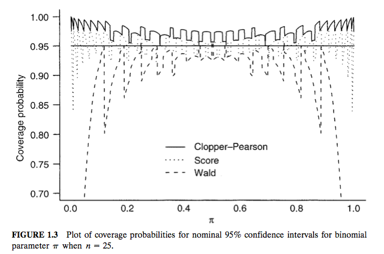

## Background
* If you've had a course in statistical theory, this chapter is likely _entirely_ review.
* <font color = "blue">Categorical variable</font>: measurement scale consisting of a set of categories.
* Research studies in the social and biomedical science drove the development of categorical data analysis (CDA).
* Applications in a myriad fields - behavioral sciences, education, engineering, ecology, public health, advertising, etc.


## Nominal scales
<div class="centered">

<p>
</p>

</div>

## Ordinal scales  
<div class="centered">
  
  <p>
</p>
  <p>
</p>

</div>

## Interval scale

* Natural order
* Distance between categories known.
* The way a variable is measured affects its classification.
* Interval > Ordinal > Nominal Hierarchy
* Methods for ordinal data __can__ be applied to interval data but __not__ the other way around.
* Usually best to use methods developed for a particular scale.

## Other variable distinctions
 > - <font color = "blue">Continuous </font> vs. <font color = "blue">discrete</font> variables
 > - Many vs. few categories
 > - <font color = "blue">Qualitative</font> vs. <font color = "blue">Quantitative</font> variables.
 > - Quality vs. quantity
 
 

## Binomial distribution
 > - <font color = "red">Number of days late to class in a week</font>. 
 > - Let $y_1, y_2, ..., y_n$ be realizations of $Y_1, Y_2, Y_n$ that are i.i.d. with a fixed number, *n*, of binary observations.  
 > - Then $P(Y_i = 1) = p$ (success) and $P(Y_i = 0) = 1 - p$ (failure).
 > - Late ("success") and ontime ("failure")
 > -  Each realization is a <font color = "blue">Bernoulli</font> trial, where the total number of successes, $Y = \sum_{i = 1}^n Y_i$ is distributed with a Bin(n, p).

## Binomial (continued)
$$ Pr(y) = \binom{n}{y}p^y (1 - p)^{n - y} $$

> - $E(Y_i) = p$ and $E(\sum_{i = 1}^n Y_i) = np$
> - $var(Y_i)  = p(1 - p) = pq$ and $var(\sum_{i = 1}^n Y_i) = np(1 - p) = npq$.
> - Maxium variability when $p$ = 0.50
> - For a fixed *p*, as $n \rightarrow \infty$, Binomial $\rightarrow$ normal
> -  Hypergeometric appropriate when binary observations are not i.i.d.
> - Often model $p$ with covariates and a binomial logistic regression

## Multinomial distribution

> - *n* realizations with an outcome with *C* categories (C = 2 special case).
> - Let $y_{ij}$ = 1 if type *i* has outcome in category *j*, else $y_{ij}$ = 0. 
> - If $\mathbf{y_i} = (y_{i1}, y_{i2}, .., y_{ic})$ ($y_{ic}$ is linearly dependent on the other outcomes).
> - Let $n_j = \sum_{i}y_{ij}$, then $(n_1, n_2, ..., n_c) \sim Multi(n, p_1, p_2, ..., p_c)$  

## Multinomial (continued)

$$Pr(n_1, n_2, ..., n_{c-1}) = \frac{n!}{n_1!n_2! \cdots n_c!}p_1^{n_1}p_2^{n_2}\cdots p_c^{n_c} $$

> - $E(n_j) = np_j$
> - $var(n_j) = np_j(1 - p_j)$
> - $cov(n_j, n_k) =  -np_jp_k$
> - Marginal distributions of $n_j$ are binomial.
> - When C = 2, the binomial is a special case.

## Poisson
> - Unbounded, non-negative counts.
$$Pr(y) = \frac{e^{-\lambda}\lambda^y}{y!}$$
for *y* = 0, 1, 2, ...
> - $E(y) = var(y) = \lambda$.
> - As $\lambda \rightarrow \infty$, Poisson $\rightarrow$ normal.
> - Approximation of the binomial when $n$ is large and $p$ is small ($\lambda = np$).
> - The sum of Poissons is also distributed with a Poisson and if we condition on _n_ then this has a Multinomial distribution.

## Problems with these distributions
> - Overdispersion, $D = var(Y)/E(Y)$
> - For Poission, may need negative binomial (a Gamma mixture of Poisson distributions).
> -  Models are too simplistic or misspecified.


## Parameter estimation, MLE
* Typically use MLE (could use Bayes, of course)
  * They have large-sample normal distributions
	* they are asymptotically consistent 
	* converging to the parameter as n increases;  
	* are asymptotically efficient, producing large-sample standard errors no greater than those from other estimation methods. 
* MLE of $\hat{\beta} = \frac{dL(\beta)}{d\beta} = 0$ and SEs are the square roots of the diagonal elements of the inverse information matrix. 

## MLE Bernoulli
$$ pmf : Pr(y) = \binom{n}{y}p^y (1 - p)^{n - y} $$
$$ L(p) = p^y (1 - p)^{n - y} $$
$$ \log L(p) = y\log p + (n - y) \log(1-p) $$
$$ \frac{d \log L(p)}{d p} = \frac{y}{p}  - \frac{n - y}{1 - p}$$
$$ \frac{d \log L(p)}{d p} = \frac{y - yp - np - yp}{p (1 - p)}$$
$$ 0 = \frac{y - np}{p (1 - p)} \rightarrow y - np = 0 \rightarrow p = y/n$$


## Wald, LRT, and score tests
> - Wald : z = $(\hat{\beta} - \beta_0)/SE$
> - LRT: -2 $\log(l_0/l_1)$, where $l_0$ max. value logLik fx under $H_0$ restriction and max. logLik fx $l_1$ without restriction of $H_0$.
> - Score: Based on slope and expected curvature of logLik fx at $\beta_0$.
> -  $u(\beta) = dL/d\beta$ at $\beta_0$, typically large when $\hat{\beta}$ away from $\beta_0$.
> - Score = $u(\beta)/\sqrt{i(\beta_0)}$
> - Wald and Score follow a Z and LRT follows a $\chi^2$

## Plot of logLik fx {.smaller}
<div class="centered">

</div>

* Wald uses L($\beta$) behavior at MLE for SE (nonnull)
* Score uses L($\beta$) behavior at H$_O$ for SE (null)
* LRT uses information at both and is twice the vertical distance from $\beta$ to $\beta_0$.
* Can of course construct CIs. 

## Comparsions
* All three methods are likelihood based
* The Wald test uses the NONNULL standard error
* The Score test uses the NULL standard error (information evaluated at the null)
* The likelihood ratio test combines information from the null and observed likelihoods
* For small to medium samples, the likelihood ratio test is better
* I've been taught to only consider the LRT

## Single parameter tests
* Agresti derives hyptothesis tests/CIs for binomial parameter for Wald, score, and LRT and then multinomial parameters.
* Show poor performance of Wald confidence intervals when parameter lies on the boundary of the sample space (asks a class "who is vegetarian?", 0 yes, 26 no).
* Better performance of score and LRT.
* When $n$ is small recommends the Clopper-Pearson method for CIs.
* Clopper-Pearson method for confidence interval uses $P$-values from a binomial exact test.
* Actual coverage always greater than .95

## Performance {.flexbox .vcenter}


## Clopper-Pearson with mid-$P$-value
* mid-*P*-value = $1/2 Pr(T = t\_0) + P(T > t\_0)$
* Thus mid-*P*-value is less than the ordinary *P*-value by half the probability of the observed result.


## Multinomial 
* Pearson's chi-squared statistic, X$^2$ - $\sum\frac{(obs-exp)^2}{exp}$ with df = c - 1
* LRT chi-squared statistic, G$^2$ - $2 \sum n_j log(n_j/np_{j0})$, for large *n*, df = c - 1. 
* Mendel's data
* Chi-squared approximation of G$^2$ poor when $n / c < 5$ and fine for X$^2$ when c is large and $n/c$ is as small as 1 if exp freq aren't too big or too small. 

## Simple example in `R`
```{r}
set.seed(123)
y <- rbinom(10, size = 1, prob = .3)
success <- sum(y[y==1])
prop.test(success, n = 10, correct = FALSE)  ## pseudo-Wald
```

## Simple example in `R`
```{r}
binom.test(success, n = 10)  ## Clopper & Pearson
```

## `R` when y is on the sample space
```{r}
y <- rep(1, 10)
success <- sum(y[y==1])
prop.test(success, n = 10, correct = FALSE)  ## pseudo-Wald
```

## `R` when y is on the sample space
```{r}
binom.test(success, n = 10)  ## Clopper & Pearson
```

## `R` Pearson's chi-squared test
```{r}
x <- c(A = 16, B = 15, C = 17)
chisq.test(x)  # Ho = p1 = p2 = p3
```

## `R` Another Pearson's chi-squared test
```{r}
x <- c(A = 40, B = 20, C = 10)
chisq.test(x)
```


