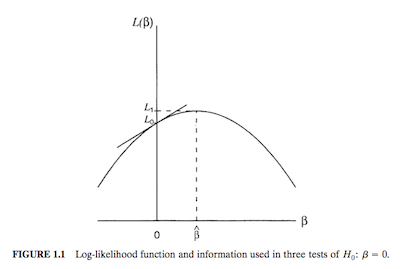

### Chapter Overview
* If you've had a course in statistical theory, this chapter is likely entirely review.


### Background
* <font color = "blue">Categorical variable</font> : measurement scale consisting of a set of categories.


* Research studies in the social and biomedical science drove the development of categorical data analysis (CDA).
* Applications in a myriad fields - behavioral sciences, education, engineering, ecology, public health, advertising, etc.

### Types of Scales
* <font color = blue>Nominal</font> - No natural order.
	* County of Origin - Iceland, USA, Poland, ... 
	* Gender - Female, Male	
* <font color = blue>Ordinal</font> - Natural order; distance between categories unknown. 
	* Poltical Views - Liberal, Moderate, Conservative
	* Health - Good, Fair, Poor
	* Rating Scales
* <font color = blue>Interval</font> - Natural order; distance between categories known.
* Interval > Ordinal > Nominal Hierarchy
	* Methods for ordinal data **can** be applied to interval data but **not** the other way around.
	* Best to use methods developed for a particular scale.
  * <font color = "blue">Continuous </font> vs. <font color = "blue">Discrete</font> and <font color = "blue">Qualitative</font> vs. <font color = "blue">Quantitative</font> variables.

### Distributions

#### Binomial
* Let $y\_1, y\_2, ..., y\_n$ be realizations of $Y\_1, Y\_2, Y\_n$ that are i.i.d. with a fixed number, *n*, of binary observations.  
* Then $P(Y_i = 1) = p$ (success) and $P(Y_i = 0) = 1 - p$ (failure).
* Each realization is a <font color = "blue">Bernoulli</font> trial, where the total number of successes, $Y = \sum_{i = 1}^n Y_i$ is distributed with a Bin(n, p).
* The pmf for possible outcomes *y* for is *Y* is  
$$ Pr(y) = \binom{n}{y}p^y (1 - p)^{n - y} $$
Where $E(Y_i) = p$ and $var(Y_i)  = p(1 - p) = pq$ for a Bernoulli trial and $E(\sum_{i = 1}^n Y_i) = np$ and $var(\sum\_{i = 1}^n Y_i) = np(1 - p) = npq$.
* For a fixed *p*, as $n \rightarrow \infty$, Binomial $\rightarrow$ normal
* Hypergeometric appropriate when binary observations are not i.i.d.

#### Multinomial
* *n* realizations with an outcome with *C* categories.
* Let $y\_{ij}$ = 1 if type *i* has outcome in category *j*, else $y\_{ij}$ = 0. Then $ \mathbf{y_i} = (y\_{i1}, y\_{i2}, .., y\_{ic}) $ and $y\_{ic}$ is linearly dependent on the other outcomes.
* Let $n_j = \sum\_{i}y\_{ij}$, then $(n_1, n_2, ..., n_c) \sim Multi(n, p\_1, p\_2, ..., p\_c)$  
* The pmf is:
$$Pr(n_1, n_2, ..., n\_{c-1}) = \frac{n!}{n_1!, n_2!, \cdots,n_c!}p_1^{n_1}p_2^{n_2}\cdots p_c^{n_c} $$

Where $E(n_j) = np_j$; $var(n_j) = np_j(1 - p_j)$; and $cov(n_j, n_k) =  -np_jp_k$
* Marginal distributions of $n_j$ are Binomial.

#### Poisson
* Unbounded, non-negative counts (e.g. number of hérna in a heitur pottur in 15 minutes).
$$Pr(y) = \frac{e^{-\mu}\mu^y}{y!}$$
for *y* = 0, 1, 2, ...
* $E(y) = var(y) = \mu$.
* As $\mu \rightarrow \infty$, Poisson $\rightarrow$ normal.
* Approximation of the binomial when $n$ is large and $p$ is small ($\mu = np$).
* The sum of Poissons is also distributed with a Poission and if we condition on *n* then this has a multinomial distribution.

### Problems with these distributions

* Overdispersion
	* For Poission, may need negative binomial
* Models are too simplistic or misspecified.

### Parameter estimation
* Often use MLE
	* They have large-sample normal distributions
	* they are asymptotically consistent 
	* converging to the parameter as n increases;  
	* are asymptotically efficient, producing large-sample standard errors no greater than those from other estimation methods. 
* MLE of $\hat{\beta} = \frac{dL(\beta)}{d\beta} = 0$ and SEs are the square roots of the diagonal elements of the inverse information matrix. 

### Hypothesis testing and CIs
* Wald, LRT, and score tests



* Wald uses L($\beta$) behavior at MLE
* Score uses L($\beta$) behavior at H$_O$.
* LRT uses information at both.
* Can of course construct CIs. 
* LRT is the statistic **that has always been recommended to me** given it's better performance with small to moderate sample sizes.

### Single parameter tests
* Agresti derives hyptothesis tests/CIs for binomial parameter and multinomial parameters.
* 
#### Binomial
* Demonstrates poor performance of these confidence intervals when parameter lies on/is close to the boundary of the parameter space.
* Presents Clopper-Pearson method for confidence intervals.
	


* mid-*P*-value = $1/2 Pr(T = t\_0) + P(T > t\_0)$
* Thus mid-*P*-value is less than the ordinary *P*-value by half the probability of the observed result.

#### Multinomial 
* For multinomial parameters, presents Pearson's chi-squared statistic, X$^2$ - $\sum\frac{(obs-exp)^2}{exp}$ with df = c - 1 and LRT chi-squared statistic (G$^2$) - $2 \sum n\_j log(n\_j/np\_{j0})$, for large *n*, df = c - 1. 
	* Mendel's data
* Chi-squared approximation of G$^2$ poor when $n / c < 5$ and fine for X$^2$ when c is large and $n/c$ is as small as 1 if exp freq aren't too big or too small. 

#### Example in `R` (sneak peek for more interesting stuff!)
```{r, include = FALSE}
test.table=function(ct, conf.level=0.95)
{
  nr=nrow(ct)
  nc=ncol(ct)
  
  cct=ct
  if( (nr==2) && (nc==2) )
  {
    cct=ct
    adjusted=NULL
    if(any(cct==0))
    {
     cct=cct+0.5
     adjusted="adjusted"
    }
    sor=cct[1,1]*cct[2,2]/(cct[2,1]*cct[1,2])
    slor=log(sor)
    se=sqrt(sum(1/cct))
    me=qnorm(1-(1-conf.level)/2)*se
    CI = c(slor - me, slor + me)
    eCI=exp(CI)
    cat("----------------------------------------------------------------\n")    
    cat("Approximate inference for the log odds and odds ratio parameters\n")
    cat("----------------------------------------------------------------\n")    
    cat("Sample log odds ratio value = ", slor, "\n")
    cat(100*conf.level, "% ", adjusted, " confidence interval for the log odds ratio parameter\n", sep="")  
    cat("(", CI[1], ", ", CI[2], ")\n\n", sep="")
    cat("Sample odds ratio value = ", sor, "\n")
    cat(100*conf.level, "% ", adjusted, " confidence interval for the odds ratio parameter\n", sep="")  
    cat("(", eCI[1], ", ", eCI[2], ")\n\n", sep="")   
  }
  cat("-----------------\n")    
  cat("Chi-squared tests\n")
  cat("-----------------\n")
  dfr=(nr-1)*(nc-1)  
  expected = apply(ct, 1, sum) %o% apply(ct, 2, sum) / sum(ct)
  x.sq=sum( (ct-expected)^2 / expected)
  g.sq = 2*sum( ct * log(ct/expected) )
  pval.x.sq=1-pchisq(x.sq, dfr)
  pval.g.sq=1-pchisq(g.sq, dfr)
  cat("x^2 = ", x.sq, ", df = ", dfr, ", p-value = ", pval.x.sq, "\n", sep="") 
  cat("g^2 = ", g.sq, ", df = ", dfr, ", p-value = ", pval.g.sq, "\n\n", sep="") 
  cat("Pearson standardized residuals\n")
  col.vec = sqrt(1-apply(ct, 1, sum)/sum(ct))
  row.vec = sqrt(1-apply(ct, 2, sum)/sum(ct))
  scale.matrix = col.vec %o% row.vec
  pearson.standardized.residuals=(ct - expected)/(sqrt(expected)*scale.matrix)
  print(pearson.standardized.residuals)
}
```

```{r}

## Table 3.1, 
ct = as.table( rbind(c(28, 656), c(18, 658)) )
rownames(ct) = c("Placebo", "Aspirin")
colnames(ct) = c("Yes", "No") ## Myocardial infarction
ct
test.table(ct)

ct = as.table( rbind(c(178, 138, 108), c(570, 648, 442), c(138, 252, 252)) )
colnames(ct)=c("F", "M", "L")  ## Religious beliefs, Fund, Mod, Lib
rownames(ct)=c("LH", "HJC", "BG")  ## Highest degree,  < High, High or jr college, Bach or grad
ct
test.table(ct)
```
	
<font color = "red"> Note. Figures from Agresti (2002).


