```r
# Introduction to R
# Christopher David Desjardins
# 26 June 2015
#
# Section 0. Installing R & Rstudio
#
# These are comments. You can run these lines of code (Ctrl + Enter) 
# and R will not run them.
# 2 + 2
2 + 2
```

```
## [1] 4
```

```r
# For R, http://cran.uib.no/  
#
# If you are installing the Windows version, click "base" subdirectory
# There is no reason (that I'm aware of) to use 32 bit R if you can
# use 64 bit R.
#
# For Rstudio, http://www.rstudio.com/products/rstudio/download/ 
# You want the Open Source Edition (this is a new phenomenon).
#
# There are other ways to interact with R
# If you use Mac, the Rgui by itself is fine
# If you use Emacs, http://ess.r-project.org/
# 
# The closest thing to a GUI for R is Rcmdr
install.packages("Rcmdr")  # This only needs to be done once
```

```
## also installing the dependencies 'Formula', 'latticeExtra', 'acepack', 'Hmisc', 'e1071', 'RcmdrMisc', 'car', 'tcltk2', 'abind'
```

```
## 
## The downloaded binary packages are in
## 	/var/folders/5_/qdj_x2vj1yxg2wykk6f84b340000gn/T//RtmpeC7aW8/downloaded_packages
```

```r
library(Rcmdr)
```

```
## Loading required package: splines
## Loading required package: RcmdrMisc
## Loading required package: car
## Loading required package: sandwich
```

```
## Error: package or namespace load failed for 'Rcmdr'
```

```r
# If you think you'll use Rcmdr then you probably want to install
# the extra packages. However, I would recommend against using 
# a GUI as it will be slower and makes me reproducibility harder.
#
# Rstudio is a nice IDE for R for both beginner's and power users.
# I'd recommend learning Rstudio, it's open-source, so it isn't
# going away.
#
# Section 1. Customizing Rstudio
# 
# Much of the Rstudio IDE is customizable. By default Rstudio
# has soft-wrap R sources files disabled. This might be something you
# wish to enable to prevent very long lines. I would recommend
# just breaking your lines after 80 characters or so anyways.
# You can find these settings under Tools -> Global Options
#
# You can also change the pane layout if you want.
#
# By default, the following layout is used.
# Upper Left - Code editor
# Bottom Left - R console 
# Upper Right - Environment, i.e. what is currently in R and History, i.e.
# what commands you have run.
# Bottom Right - Viewer for help pages, files in current directory, graphs,
# and packages. 
#
# This layout is generally OK.
#
# You'll always want write code in the Code editor and not directly in the 
# R console unless it's something you know you'll never want to write again!
#
# Section 2. R Basics
#
# Some books:
# Using R for Introductory Statistics: http://cran.r-project.org/doc/contrib/Verzani-SimpleR.pdf
# Linear models with R: http://www.amazon.com/Linear-Models-Chapman-Statistical-Science/dp/1584884258
# Extending the linear model with R: http://www.amazon.com/Extending-Linear-Model-Generalized-Nonparametric/dp/158488424X
#
# However, there's lot of R resources. So unless you want a printed R book
# you don't need to buy one. 
# What I do is often just Google my problem and I either hit 
# stackoverflow or the R-help mailing list. There are also lots of wonderful
# blogs. 
# http://www.statmethods.net/
#
# For Icelandic R videos: https://www.youtube.com/channel/UClpgj8pTFS3XT5SHYWpAbrQ
# These are R videos and statistics tutorials for the stats department at HÍ.
#
# R is programming language and a statistics environment

# To install a library in R use the install.package() function
# Some libraries of interest here.

install.packages("irtoys")  # IRT models
```

```
## also installing the dependencies 'expm', 'sfsmisc', 'msm', 'polycor', 'sm', 'ltm'
```

```
## 
## The downloaded binary packages are in
## 	/var/folders/5_/qdj_x2vj1yxg2wykk6f84b340000gn/T//RtmpeC7aW8/downloaded_packages
```

```r
install.packages("ltm")  # latent trait models, 1, 2, 3-PL models, GR, GPCM
```

```
## 
## The downloaded binary packages are in
## 	/var/folders/5_/qdj_x2vj1yxg2wykk6f84b340000gn/T//RtmpeC7aW8/downloaded_packages
```

```r
library(nlme)  # HLM models
install.packages("lme4")  # HLM aka mixed effects modeling, can do Rasch modeling
```

```
## 
## The downloaded binary packages are in
## 	/var/folders/5_/qdj_x2vj1yxg2wykk6f84b340000gn/T//RtmpeC7aW8/downloaded_packages
```

```r
install.packages("lavaan")  # CFA, SEM simple output/model syntax to MPlus
```

```
## also installing the dependencies 'mnormt', 'pbivnorm', 'quadprog'
```

```
## 
## The downloaded binary packages are in
## 	/var/folders/5_/qdj_x2vj1yxg2wykk6f84b340000gn/T//RtmpeC7aW8/downloaded_packages
```

```r
install.packages("sem")  # Another SEM program
```

```
## also installing the dependency 'matrixcalc'
```

```
## 
## The downloaded binary packages are in
## 	/var/folders/5_/qdj_x2vj1yxg2wykk6f84b340000gn/T//RtmpeC7aW8/downloaded_packages
```

```r
install.packages("psych")  # CTT, FA, http://personality-project.org/r/
```

```
## 
## The downloaded binary packages are in
## 	/var/folders/5_/qdj_x2vj1yxg2wykk6f84b340000gn/T//RtmpeC7aW8/downloaded_packages
```

```r
install.packages("plyr")  # Data manipulation
```

```
## 
## The downloaded binary packages are in
## 	/var/folders/5_/qdj_x2vj1yxg2wykk6f84b340000gn/T//RtmpeC7aW8/downloaded_packages
```

```r
install.packages("reshape")  # Reshaping data from wide to long format
```

```
## 
## The downloaded binary packages are in
## 	/var/folders/5_/qdj_x2vj1yxg2wykk6f84b340000gn/T//RtmpeC7aW8/downloaded_packages
```

```r
install.packages("ggplot2")  # Graphing package 
```

```
## 
## The downloaded binary packages are in
## 	/var/folders/5_/qdj_x2vj1yxg2wykk6f84b340000gn/T//RtmpeC7aW8/downloaded_packages
```

```r
install.packages("equate")  # Equating
```

```
## 
## The downloaded binary packages are in
## 	/var/folders/5_/qdj_x2vj1yxg2wykk6f84b340000gn/T//RtmpeC7aW8/downloaded_packages
```

```r
install.packages("profileR")  # Profile analysis
```

```
## 
## The downloaded binary packages are in
## 	/var/folders/5_/qdj_x2vj1yxg2wykk6f84b340000gn/T//RtmpeC7aW8/downloaded_packages
```

```r
install.packages("mice")  # multiple imputation
```

```
## also installing the dependency 'randomForest'
```

```
## 
## The downloaded binary packages are in
## 	/var/folders/5_/qdj_x2vj1yxg2wykk6f84b340000gn/T//RtmpeC7aW8/downloaded_packages
```

```r
install.packages("mirt")  # multidimensional IRT
```

```
## also installing the dependencies 'GPArotation', 'numDeriv'
```

```
## 
## The downloaded binary packages are in
## 	/var/folders/5_/qdj_x2vj1yxg2wykk6f84b340000gn/T//RtmpeC7aW8/downloaded_packages
```

```r
# Load a library
library(foreign)  # This is library needs to be loaded to read SPSS data

# List the functions in a particular package
lsf.str("package:foreign")
```

```
## data.restore : function (file, print = FALSE, verbose = FALSE, env = .GlobalEnv)  
## lookup.xport : function (file)  
## read.arff : function (file)  
## read.dbf : function (file, as.is = FALSE)  
## read.dta : function (file, convert.dates = TRUE, convert.factors = TRUE, missing.type = FALSE, 
##     convert.underscore = FALSE, warn.missing.labels = TRUE)  
## read.epiinfo : function (file, read.deleted = FALSE, guess.broken.dates = FALSE, 
##     thisyear = NULL, lower.case.names = FALSE)  
## read.mtp : function (file)  
## read.octave : function (file)  
## read.S : function (file)  
## read.spss : function (file, use.value.labels = TRUE, to.data.frame = FALSE, max.value.labels = Inf, 
##     trim.factor.names = FALSE, trim_values = TRUE, reencode = NA, 
##     use.missings = to.data.frame)  
## read.ssd : function (libname, sectionnames, tmpXport = tempfile(), tmpProgLoc = tempfile(), 
##     sascmd = "sas")  
## read.systat : function (file, to.data.frame = TRUE)  
## read.xport : function (file)  
## write.arff : function (x, file, eol = "\n", relation = deparse(substitute(x)))  
## write.dbf : function (dataframe, file, factor2char = TRUE, max_nchar = 254)  
## write.dta : function (dataframe, file, version = 7L, convert.dates = TRUE, tz = "GMT", 
##     convert.factors = c("labels", "string", "numeric", "codes"))  
## write.foreign : function (df, datafile, codefile, package = c("SPSS", "Stata", "SAS"), 
##     ...)
```

```r
# To see vignettes
vignette()
vignette("Guide")
```

```
## Warning: vignette 'Guide' found more than once,
## using the one found in '/Library/Frameworks/R.framework/Versions/3.1/Resources/library/GPArotation/doc'
```

```r
# To find out information about a function:
?read.spss  # In spite of the cavaet, I have had no issues with this function

# To search for a keyword
??item

# What data sets are available?
data()

# Which data sets belong to ltm, irtoys, and lme4?
data(package = c("lme4","ltm","irtoys"))

# Check what directory we're working from and set it
getwd()
```

```
## [1] "/Users/chris/Github/Presentations/namsmatsstofnun"
```

```r
setwd("build/github/Presentations/namsmatsstofnun")
```

```
## Error: cannot change working directory
```

```r
# To see what's in that directory
dir()
```

```
## [1] "26_june_intro_R.R"   "26_june_intro_R.Rmd" "person.resp.csv"    
## [4] "precol.csv"          "precol.txt"          "STAT_PRECOLLEGE.sav"
```

```r
# Import the STAT_PRECOLLEGE dataset from SPSS
# "<-" this is the assignment operator
precol <- read.spss(file = "STAT_PRECOLLEGE.sav", to.data.frame = T)
# I recomend always naming objects in lowercase.
# If you want to combine words use lower.case

# Note that precol appears in the Environment window (UR)
# You can also see that by running ls() in R
ls()
```

```
## [1] "precol" "x"      "y"
```

```r
# You can also note the History tab

# Investigate the first few cases
head(precol)
```

```
##   SECTION GENDER   ETHDESCR CUM_GPA CUMCREDS ACT_TOTL ACT_ENGL ACT_MATH
## 1       1      F Unknown       2.15    39.00       15       16       14
## 2       1      F White         2.26    44.00       22       25       19
## 3       1      M Asian         1.96    36.00       15       10       18
## 4       1      F White         1.77    24.34       NA       NA       NA
## 5       1      F White         3.60    59.00       25       24       26
## 6       1      M White           NA    14.00       18       17       17
##   ACT_READ ACT_SCIR HSPR LTRGRADE STATGRAD DEVSTDNT
## 1        9       21   65       D         1      YES
## 2       20       22   52       C         2      YES
## 3       14       19   NA       W        NA      YES
## 4       NA       NA   NA       W        NA      YES
## 5       25       26   49       A         4      YES
## 6       16       21   65       B         3      YES
```

```r
# and the last few
tail(precol)
```

```
##     SECTION GENDER   ETHDESCR CUM_GPA CUMCREDS ACT_TOTL ACT_ENGL ACT_MATH
## 146       4      M White         2.42   124.82       NA       NA       NA
## 147       4      M White         1.83    82.00       NA       NA       NA
## 148       4      F White           NA    50.30       NA       NA       NA
## 149       4      M Asian         3.22    49.00       26       20       26
## 150       4      F White           NA    18.00       NA       NA       NA
## 151       5      F Black         3.20    40.00       21       21       19
##     ACT_READ ACT_SCIR HSPR LTRGRADE STATGRAD DEVSTDNT
## 146       NA       NA   NA       C         2      NO 
## 147       NA       NA   NA       B         3      NO 
## 148       NA       NA   NA       B         3      NO 
## 149       32       26   82       B         3      NO 
## 150       NA       NA    9       A         4      NO 
## 151       25       20   NA       C         2      NO
```

```r
# view all data
precol
```

```
##     SECTION GENDER   ETHDESCR CUM_GPA CUMCREDS ACT_TOTL ACT_ENGL ACT_MATH
## 1         1      F Unknown       2.15    39.00       15       16       14
## 2         1      F White         2.26    44.00       22       25       19
## 3         1      M Asian         1.96    36.00       15       10       18
## 4         1      F White         1.77    24.34       NA       NA       NA
## 5         1      F White         3.60    59.00       25       24       26
## 6         1      M White           NA    14.00       18       17       17
## 7         1      M White         2.57    42.00       30       34       22
## 8         1      F White         2.99    34.00       19       21       15
## 9         1      M White         3.81    37.00       18       17       16
## 10        1      M White         2.20    35.00       20       17       19
## 11        1      F Asian         3.90    41.00       16       13       18
## 12        1      M Asian         3.11    35.00       19       18       17
## 13        1      F Black           NA    12.00       12        8       15
## 14        1      F White         4.00    33.00       17       19       13
## 15        1      F White           NA    44.00       21       20       18
## 16        1      M White         3.14    14.00       17       14       18
## 17        1      F Black         3.33    33.00       16       17       17
## 18        1      M Black         2.39    27.00       18       16       15
## 19        1      M White         2.86    34.00       18       18       19
## 20        1      F White           NA    14.00       22       23       25
## 21        1      M White           NA     8.00       22       26       18
## 22        1      F White           NA    11.00       19       19       22
## 23        1      M White           NA    15.00       20       22       18
## 24        2      F White         2.41    49.00       18       19       16
## 25        2      F Black         2.95    64.00       18       17       22
## 26        2      F Black         3.42    20.00       20       19       21
## 27        2      M White         2.97    38.00       17       15       19
## 28        2      M White         1.99    43.00       20       21       16
## 29        2      M White         2.85    35.00       25       23       18
## 30        2      M White         2.97    32.00       20       21       19
## 31        2      M White         2.77    33.00       18       20       16
## 32        2      F White         3.58    36.00       17       16       19
## 33        2      F White         2.46    34.00       23       22       20
## 34        2      M White         3.05    35.00       22       18       22
## 35        2      M White         3.65    36.00       20       18       25
## 36        2      F White           NA    15.00       23       21       20
## 37        2      M White         2.58    27.00       21       21       22
## 38        2      M White         2.80    31.00       18       14       21
## 39        2      F White         3.07    35.00       20       19       19
## 40        2      F White         3.65    37.00       22       22       21
## 41        2      F Am. Indian    2.25    20.00       12       10       12
## 42        2      F White         3.00    38.00       19       20       17
## 43        2      F Asian           NA    33.00       19       17       20
## 44        2      F White         2.96    29.00       23       22       21
## 45        2      M White         2.71    23.00       20       19       19
## 46        2      M Black         2.50    35.00       17       13       18
## 47        2      M Black         3.08    37.00       NA       NA       NA
## 48        2      M Black         2.47    26.00       19       20       20
## 49        2      M White           NA    12.00       17       17       20
## 50        2      M White         2.95    35.00       20       21       21
## 51        2      F White           NA    12.00       19       21       17
## 52        2      F White           NA    12.00       NA       NA       NA
## 53        3      M White         2.25    38.68       NA       NA       NA
## 54        3      M Black         2.07    57.67       NA       NA       NA
## 55        3      M Asian         1.96    43.67       NA       NA       NA
## 56        3      F White         2.69    38.00       22       18       20
## 57        3      F White         2.07    31.34       18       16       18
## 58        3      F White         3.07    42.00       20       18       20
## 59        3      F White           NA    14.00       21       23       20
## 60        3      M White         3.04    38.00       20       16       26
## 61        3      M White         2.21    28.00       20       18       21
## 62        3      M White         2.56     9.00       21       18       21
## 63        3      F White         2.06    16.00       19       19       18
## 64        3      F White         3.22    39.00       22       24       21
## 65        3      M Black         2.05    23.00       17       18       18
## 66        3      M White         2.65    30.00       26       28       24
## 67        3      M Black           NA    16.00       19       15       23
## 68        3      F White           NA    15.00       19       17       17
## 69        3      F White         2.17    41.00       24       25       20
## 70        3      F Asian           NA    16.00       22       20       20
## 71        3      F White           NA    12.00       NA       NA       NA
## 72        4      M Black         2.64    33.35       NA       NA       NA
## 73        4      F White         2.07    37.00       14       11       14
## 74        4      M White         2.16    33.00       18       16       20
## 75        4      F White         2.12    50.00       19       16       22
## 76        4      M White         2.50    10.00       24       24       22
## 77        4      F White         2.63    30.00       20       20       18
## 78        4      M White         2.72    35.00       20       17       23
## 79        4      M Asian         2.67    28.00       19       14       17
## 80        4      F Black           NA    11.00       17       17       22
## 81        4      F White         3.24    33.00       20       15       18
## 82        4      F White         3.50    34.00       19       18       20
## 83        4      F White         2.12    37.00       19       22       19
## 84        4      F White         3.67    33.00       19       15       16
## 85        4      F White           NA    15.00       22       23       19
## 86        4      M White           NA    15.00       23       22       24
## 87        4      M White           NA    23.00       26       26       23
## 88        4      F White           NA    14.00       21       18       20
## 89        4      F White           NA    15.00       20       22       17
## 90        4      F Asian           NA    12.00       15       13       17
## 91        4      M White           NA    12.00       22       19       20
## 92        5      M Asian         2.98    16.00       29       27       27
## 93        5      F White         2.36    69.00       NA       NA       NA
## 94        5      M White         1.61    23.00       20       18       19
## 95        5      F Black         2.74    34.00       15       10       15
## 96        5      M Unknown       2.86    57.00       26       23       29
## 97        5      F White         2.08    48.00       18       17       18
## 98        5      M White         2.46    55.00       22       19       26
## 99        5      F White         2.93    64.00       19       22       17
## 100       5      F White         2.34    53.00       18       20       18
## 101       5      F White         2.64    38.00       19       21       20
## 102       5      M White         1.56    40.00       22       22       20
## 103       5      F White         2.93    37.00       17       16       17
## 104       5      M White         3.24    41.50       17       19       16
## 105       5      F White         3.48    33.00       18       18       20
## 106       5      M White         3.24    35.00       17       15       17
## 107       5      M White         2.67    41.00       15       12       16
## 108       5      F White         1.74    21.00       15       16       14
## 109       5      F White         2.86    43.00       16       16       15
## 110       5      M White         3.61    48.00       21       19       17
## 111       5      F White         1.59    15.00       24       26       22
## 112       5      F White         2.59    38.00       20       20       17
## 113       5      F White         2.15    29.00       22       24       24
## 114       5      F White         3.06    43.00       17       19       16
## 115       5      M White         3.46    42.00       27       27       28
## 116       5      M White         3.11    46.50       18       16       20
## 117       5      M White         1.68    30.00       24       23       25
## 118       5      F White         2.49    38.00       18       16       22
## 119       5      F White         3.00    37.00       17       17       16
## 120       5      F White           NA    30.00       24       21       21
## 121       5      M White           NA    11.00       21       23       18
## 122       5      F White           NA    13.00       19       15       21
## 123       1      F Black         3.34   114.33       NA       NA       NA
## 124       1      F White         3.29   108.66       NA       NA       NA
## 125       1      F White         2.84    47.00       26       23       26
## 126       1      F Black         2.75    66.00       17       19       18
## 127       1      F Black         2.33    60.67       NA       NA       NA
## 128       1      F Unknown         NA    88.00       NA       NA       NA
## 129       2      F Asian         2.63    70.32       NA       NA       NA
## 130       2      F White         3.67    43.00       23       25       25
## 131       2      F White         2.85    87.00       21       19       18
## 132       2      M White         2.63    99.00       NA       NA       NA
## 133       3      M White         3.54    88.34       NA       NA       NA
## 134       3      M Unknown       2.81   193.34       NA       NA       NA
## 135       3      M Black         2.20   116.66       NA       NA       NA
## 136       3      M White         2.73   135.01       NA       NA       NA
## 137       3      F White         3.17   130.68       NA       NA       NA
## 138       3      F White         3.80   114.67       NA       NA       NA
## 139       3      M White         2.41    77.67       NA       NA       NA
## 140       3      F White         2.91    66.00       24       25       22
## 141       3      F White         3.36    47.00       24       21       25
## 142       3      F White         3.06    36.00       20       19       19
## 143       3      M White           NA    12.00       24       18       26
## 144       3      F White           NA    84.00       NA       NA       NA
## 145       4      F White         2.61   107.67       NA       NA       NA
## 146       4      M White         2.42   124.82       NA       NA       NA
## 147       4      M White         1.83    82.00       NA       NA       NA
## 148       4      F White           NA    50.30       NA       NA       NA
## 149       4      M Asian         3.22    49.00       26       20       26
## 150       4      F White           NA    18.00       NA       NA       NA
## 151       5      F Black         3.20    40.00       21       21       19
##     ACT_READ ACT_SCIR HSPR LTRGRADE STATGRAD DEVSTDNT
## 1          9       21   65       D      1.00      YES
## 2         20       22   52       C      2.00      YES
## 3         14       19   NA       W        NA      YES
## 4         NA       NA   NA       W        NA      YES
## 5         25       26   49       A      4.00      YES
## 6         16       21   65       B      3.00      YES
## 7         29       34   NA       A-     3.67      YES
## 8         20       21   51       D      1.00      YES
## 9         19       22   NA       B      3.00      YES
## 10        25       22   58       D+     1.33      YES
## 11        18       17   72       A      4.00      YES
## 12        22       20   55       C      2.00      YES
## 13        12       14   45       F      0.00      YES
## 14        19       20   65       B+     3.33      YES
## 15        23       21   51       C-     1.67      YES
## 16        18       16   NA       W        NA      YES
## 17        14       16   NA       B-     2.67      YES
## 18        19       22   61       D+     1.33      YES
## 19        14       21   NA       F      0.00      YES
## 20        17       25   53       C      2.00      YES
## 21        24       21   37       D      1.00      YES
## 22        15       19   45       F      0.00      YES
## 23        23       19   73       C      2.00      YES
## 24        20       18   49       B-     2.67      YES
## 25        14       19   68       B+     3.33      YES
## 26        23       18   33       A      4.00      YES
## 27        19       18   49       B-     2.67      YES
## 28        22       23   46       W        NA      YES
## 29        32       28   39       C+     2.33      YES
## 30        24       17   51       B      3.00      YES
## 31        19       18   36       C-     1.67      YES
## 32        15       18   41       C      2.00      YES
## 33        27       25   38       C+     2.33      YES
## 34        24       25   58       B-     2.67      YES
## 35        18       19   67       B-     2.67      YES
## 36        25       24   56       A-     3.67      YES
## 37        20       21   50       W        NA      YES
## 38        21       19   49       F      0.00      YES
## 39        21       22   46       C-     1.67      YES
## 40        22       24   27       A-     3.67      YES
## 41        12       14   50       F      0.00      YES
## 42        17       21   31       W        NA      YES
## 43        18       21   52       A      4.00      YES
## 44        27       22   NA       C+     2.33      YES
## 45        22       20   50       W        NA      YES
## 46        18       19   35       C-     1.67      YES
## 47        NA       NA   54       C      2.00      YES
## 48        17       20   NA       N      0.00      YES
## 49        14       19   53       C-     1.67      YES
## 50        19       21   45       A-     3.67      YES
## 51        21       18   54       C+     2.33      YES
## 52        NA       NA   49       W        NA      YES
## 53        NA       NA   NA       B-     2.67      YES
## 54        NA       NA   NA       C      2.00      YES
## 55        NA       NA   NA       F      0.00      YES
## 56        30       21   40       F      0.00      YES
## 57        18       19   NA       W        NA      YES
## 58        19       23   59       B      3.00      YES
## 59        21       23   NA       B-     2.67      YES
## 60        18       20   35       C      2.00      YES
## 61        21       23   42       C      2.00      YES
## 62        21       23   NA       W        NA      YES
## 63        22       17   NA       F      0.00      YES
## 64        23       18   44       C+     2.33      YES
## 65        15       19   NA       W        NA      YES
## 66        25       28   32       D      1.00      YES
## 67        20       20   72       B      3.00      YES
## 68        20       24   NA       B      3.00      YES
## 69        27       23   23       C-     1.67      YES
## 70        27       23   44       D+     1.33      YES
## 71        NA       NA   60       A      4.00      YES
## 72        NA       NA   NA       F      0.00      YES
## 73        16       16   NA       F      0.00      YES
## 74        17       21   34       C-     1.67      YES
## 75        22       18   50       D      1.00      YES
## 76        26       22   NA       W        NA      YES
## 77        22       20   NA       C+     2.33      YES
## 78        17       22   52       C-     1.67      YES
## 79        24       22   59       C+     2.33      YES
## 80        14       18   46       D+     1.33      YES
## 81        21       25   58       C+     2.33      YES
## 82        19       19   59       B+     3.33      YES
## 83        16       20   36       D      1.00      YES
## 84        23       21   61       A      4.00      YES
## 85        24       22   44       B      3.00      YES
## 86        22       23   43       C+     2.33      YES
## 87        27       28   57       B+     3.33      YES
## 88        25       21   50       C+     2.33      YES
## 89        17       22   25       C-     1.67      YES
## 90        13       18   47       C-     1.67      YES
## 91        24       23   28       C+     2.33      YES
## 92        35       28   NA       W        NA      YES
## 93        NA       NA   41       C+     2.33      YES
## 94        23       21   46       D      1.00      YES
## 95        16       19   68       C      2.00      YES
## 96        23       30   38       B      3.00      YES
## 97        17       21   NA       C+     2.33      YES
## 98        23       22   39       C+     2.33      YES
## 99        18       20   64       B-     2.67      YES
## 100       19       16   39       C+     2.33      YES
## 101       17       20   50       B      3.00      YES
## 102       26       22   NA       C      2.00      YES
## 103       18       17   46       C+     2.33      YES
## 104       14       18   56       N      0.00      YES
## 105       18       18   64       B+     3.33      YES
## 106       16       19   37       B+     3.33      YES
## 107       16       16   74       C      2.00      YES
## 108       17       14   NA       W        NA      YES
## 109       16       18   49       B      3.00      YES
## 110       26       21   64       C      2.00      YES
## 111       23       25   NA       D      1.00      YES
## 112       22       22   NA       B-     2.67      YES
## 113       19       20   NA       D      1.00      YES
## 114       17       16   47       C      2.00      YES
## 115       28       25   40       C+     2.33      YES
## 116       17       21   61       C      2.00      YES
## 117       20       28   31       B      3.00      YES
## 118       16       20   38       A-     3.67      YES
## 119       18       17   NA       B      3.00      YES
## 120       26       29   39       B-     2.67      YES
## 121       22       22   13       F      0.00      YES
## 122       17       21   57       A-     3.67      YES
## 123       NA       NA   NA       B      3.00      NO 
## 124       NA       NA   NA       A      4.00      NO 
## 125       31       24   82       A      4.00      NO 
## 126       15       17   38       D      1.00      NO 
## 127       NA       NA   NA       D      1.00      NO 
## 128       NA       NA   NA       A-     3.67      NO 
## 129       NA       NA   NA       W        NA      NO 
## 130       24       18   75       A      4.00      NO 
## 131       21       26   85       A      4.00      NO 
## 132       NA       NA   NA       B-     2.67      NO 
## 133       NA       NA   NA       W        NA      NO 
## 134       NA       NA   NA       S      2.00      NO 
## 135       NA       NA   NA       F      0.00      NO 
## 136       NA       NA   NA       B-     2.67      NO 
## 137       NA       NA   NA       W        NA      NO 
## 138       NA       NA   NA       A-     3.67      NO 
## 139       NA       NA   NA       D+     1.33      NO 
## 140       26       22   21       B-     2.67      NO 
## 141       25       26   NA       A-     3.67      NO 
## 142       20       21   71       C      2.00      NO 
## 143       26       25   35       A-     3.67      NO 
## 144       NA       NA   NA       A      4.00      NO 
## 145       NA       NA   NA       A-     3.67      NO 
## 146       NA       NA   NA       C      2.00      NO 
## 147       NA       NA   NA       B      3.00      NO 
## 148       NA       NA   NA       B      3.00      NO 
## 149       32       26   82       B      3.00      NO 
## 150       NA       NA    9       A      4.00      NO 
## 151       25       20   NA       C      2.00      NO
```

```r
# If you want to see a specific observation, say #20, and you want to see responses from variables 2 through 3
precol[20,2:3]
```

```
##    GENDER   ETHDESCR
## 20      F White
```

```r
# Or if you want to see variables 1, 3, and 6 for observations 19 through 21.
precol[19:21, c(1,3,6)]
```

```
##    SECTION   ETHDESCR ACT_TOTL
## 19       1 White            18
## 20       1 White            22
## 21       1 White            22
```

```r
# To get information about the data set and the variable types
str(precol)
```

```
## 'data.frame':	151 obs. of  14 variables:
##  $ SECTION : num  1 1 1 1 1 1 1 1 1 1 ...
##  $ GENDER  : Factor w/ 2 levels "F","M": 1 1 2 1 1 2 2 1 2 2 ...
##  $ ETHDESCR: Factor w/ 5 levels "Am. Indian","Asian     ",..: 4 5 2 5 5 5 5 5 5 5 ...
##  $ CUM_GPA : num  2.15 2.26 1.96 1.77 3.6 NA 2.57 2.99 3.81 2.2 ...
##  $ CUMCREDS: num  39 44 36 24.3 59 ...
##  $ ACT_TOTL: num  15 22 15 NA 25 18 30 19 18 20 ...
##  $ ACT_ENGL: num  16 25 10 NA 24 17 34 21 17 17 ...
##  $ ACT_MATH: num  14 19 18 NA 26 17 22 15 16 19 ...
##  $ ACT_READ: num  9 20 14 NA 25 16 29 20 19 25 ...
##  $ ACT_SCIR: num  21 22 19 NA 26 21 34 21 22 22 ...
##  $ HSPR    : num  65 52 NA NA 49 65 NA 51 NA 58 ...
##  $ LTRGRADE: Factor w/ 14 levels "A ","A-","B ",..: 9 6 14 14 1 3 2 9 3 10 ...
##  $ STATGRAD: num  1 2 NA NA 4 3 3.67 1 3 1.33 ...
##  $ DEVSTDNT: Factor w/ 2 levels "NO ","YES": 2 2 2 2 2 2 2 2 2 2 ...
##  - attr(*, "variable.labels")= Named chr  "" "" "Ethnic Background" "Cumulative GPA at end of F2001" ...
##   ..- attr(*, "names")= chr  "SECTION" "GENDER" "ETHDESCR" "CUM_GPA" ...
```

```r
# To get the variable labels
attr(precol,"variable.labels")
```

```
##                            SECTION                             GENDER 
##                                 ""                                 "" 
##                           ETHDESCR                            CUM_GPA 
##                "Ethnic Background"   "Cumulative GPA at end of F2001" 
##                           CUMCREDS                           ACT_TOTL 
##  "Cumulative Credits end of F2001"             "ACT admissions score" 
##                           ACT_ENGL                           ACT_MATH 
##             "ACT English Subscore"                "ACT Math Subscore" 
##                           ACT_READ                           ACT_SCIR 
##             "ACT Reading Subscore"            "ACT Science Reasoning" 
##                               HSPR                           LTRGRADE 
##      "High School Percentile Rank" "Letter Grade in Intro Statistics" 
##                           STATGRAD                           DEVSTDNT 
##  "Final Grade in Intro Statistics"  "Developmental Education Student"
```

```r
# To get the name of all the variables
names(precol)
```

```
##  [1] "SECTION"  "GENDER"   "ETHDESCR" "CUM_GPA"  "CUMCREDS" "ACT_TOTL"
##  [7] "ACT_ENGL" "ACT_MATH" "ACT_READ" "ACT_SCIR" "HSPR"     "LTRGRADE"
## [13] "STATGRAD" "DEVSTDNT"
```

```r
# To write the data to a text file in your working directory
write.table(precol,file = "precol.txt", row.names = FALSE)
write.csv(precol, file = "precol.csv")

# To read it back in
read.table(file="precol.txt")
```

```
##          V1     V2         V3      V4       V5       V6       V7       V8
## 1   SECTION GENDER   ETHDESCR CUM_GPA CUMCREDS ACT_TOTL ACT_ENGL ACT_MATH
## 2         1      F Unknown       2.15       39       15       16       14
## 3         1      F White         2.26       44       22       25       19
## 4         1      M Asian         1.96       36       15       10       18
## 5         1      F White         1.77    24.34     <NA>     <NA>     <NA>
## 6         1      F White          3.6       59       25       24       26
## 7         1      M White         <NA>       14       18       17       17
## 8         1      M White         2.57       42       30       34       22
## 9         1      F White         2.99       34       19       21       15
## 10        1      M White         3.81       37       18       17       16
## 11        1      M White          2.2       35       20       17       19
## 12        1      F Asian          3.9       41       16       13       18
## 13        1      M Asian         3.11       35       19       18       17
## 14        1      F Black         <NA>       12       12        8       15
## 15        1      F White            4       33       17       19       13
## 16        1      F White         <NA>       44       21       20       18
## 17        1      M White         3.14       14       17       14       18
## 18        1      F Black         3.33       33       16       17       17
## 19        1      M Black         2.39       27       18       16       15
## 20        1      M White         2.86       34       18       18       19
## 21        1      F White         <NA>       14       22       23       25
## 22        1      M White         <NA>        8       22       26       18
## 23        1      F White         <NA>       11       19       19       22
## 24        1      M White         <NA>       15       20       22       18
## 25        2      F White         2.41       49       18       19       16
## 26        2      F Black         2.95       64       18       17       22
## 27        2      F Black         3.42       20       20       19       21
## 28        2      M White         2.97       38       17       15       19
## 29        2      M White         1.99       43       20       21       16
## 30        2      M White         2.85       35       25       23       18
## 31        2      M White         2.97       32       20       21       19
## 32        2      M White         2.77       33       18       20       16
## 33        2      F White         3.58       36       17       16       19
## 34        2      F White         2.46       34       23       22       20
## 35        2      M White         3.05       35       22       18       22
## 36        2      M White         3.65       36       20       18       25
## 37        2      F White         <NA>       15       23       21       20
## 38        2      M White         2.58       27       21       21       22
## 39        2      M White          2.8       31       18       14       21
## 40        2      F White         3.07       35       20       19       19
## 41        2      F White         3.65       37       22       22       21
## 42        2      F Am. Indian    2.25       20       12       10       12
## 43        2      F White            3       38       19       20       17
## 44        2      F Asian         <NA>       33       19       17       20
## 45        2      F White         2.96       29       23       22       21
## 46        2      M White         2.71       23       20       19       19
## 47        2      M Black          2.5       35       17       13       18
## 48        2      M Black         3.08       37     <NA>     <NA>     <NA>
## 49        2      M Black         2.47       26       19       20       20
## 50        2      M White         <NA>       12       17       17       20
## 51        2      M White         2.95       35       20       21       21
## 52        2      F White         <NA>       12       19       21       17
## 53        2      F White         <NA>       12     <NA>     <NA>     <NA>
## 54        3      M White         2.25    38.68     <NA>     <NA>     <NA>
## 55        3      M Black         2.07    57.67     <NA>     <NA>     <NA>
## 56        3      M Asian         1.96    43.67     <NA>     <NA>     <NA>
## 57        3      F White         2.69       38       22       18       20
## 58        3      F White         2.07    31.34       18       16       18
## 59        3      F White         3.07       42       20       18       20
## 60        3      F White         <NA>       14       21       23       20
## 61        3      M White         3.04       38       20       16       26
## 62        3      M White         2.21       28       20       18       21
## 63        3      M White         2.56        9       21       18       21
## 64        3      F White         2.06       16       19       19       18
## 65        3      F White         3.22       39       22       24       21
## 66        3      M Black         2.05       23       17       18       18
## 67        3      M White         2.65       30       26       28       24
## 68        3      M Black         <NA>       16       19       15       23
## 69        3      F White         <NA>       15       19       17       17
## 70        3      F White         2.17       41       24       25       20
## 71        3      F Asian         <NA>       16       22       20       20
## 72        3      F White         <NA>       12     <NA>     <NA>     <NA>
## 73        4      M Black         2.64    33.35     <NA>     <NA>     <NA>
## 74        4      F White         2.07       37       14       11       14
## 75        4      M White         2.16       33       18       16       20
## 76        4      F White         2.12       50       19       16       22
## 77        4      M White          2.5       10       24       24       22
## 78        4      F White         2.63       30       20       20       18
## 79        4      M White         2.72       35       20       17       23
## 80        4      M Asian         2.67       28       19       14       17
## 81        4      F Black         <NA>       11       17       17       22
## 82        4      F White         3.24       33       20       15       18
## 83        4      F White          3.5       34       19       18       20
## 84        4      F White         2.12       37       19       22       19
## 85        4      F White         3.67       33       19       15       16
## 86        4      F White         <NA>       15       22       23       19
## 87        4      M White         <NA>       15       23       22       24
## 88        4      M White         <NA>       23       26       26       23
## 89        4      F White         <NA>       14       21       18       20
## 90        4      F White         <NA>       15       20       22       17
## 91        4      F Asian         <NA>       12       15       13       17
## 92        4      M White         <NA>       12       22       19       20
## 93        5      M Asian         2.98       16       29       27       27
## 94        5      F White         2.36       69     <NA>     <NA>     <NA>
## 95        5      M White         1.61       23       20       18       19
## 96        5      F Black         2.74       34       15       10       15
## 97        5      M Unknown       2.86       57       26       23       29
## 98        5      F White         2.08       48       18       17       18
## 99        5      M White         2.46       55       22       19       26
## 100       5      F White         2.93       64       19       22       17
## 101       5      F White         2.34       53       18       20       18
## 102       5      F White         2.64       38       19       21       20
## 103       5      M White         1.56       40       22       22       20
## 104       5      F White         2.93       37       17       16       17
## 105       5      M White         3.24     41.5       17       19       16
## 106       5      F White         3.48       33       18       18       20
## 107       5      M White         3.24       35       17       15       17
## 108       5      M White         2.67       41       15       12       16
## 109       5      F White         1.74       21       15       16       14
## 110       5      F White         2.86       43       16       16       15
## 111       5      M White         3.61       48       21       19       17
## 112       5      F White         1.59       15       24       26       22
## 113       5      F White         2.59       38       20       20       17
## 114       5      F White         2.15       29       22       24       24
## 115       5      F White         3.06       43       17       19       16
## 116       5      M White         3.46       42       27       27       28
## 117       5      M White         3.11     46.5       18       16       20
## 118       5      M White         1.68       30       24       23       25
## 119       5      F White         2.49       38       18       16       22
## 120       5      F White            3       37       17       17       16
## 121       5      F White         <NA>       30       24       21       21
## 122       5      M White         <NA>       11       21       23       18
## 123       5      F White         <NA>       13       19       15       21
## 124       1      F Black         3.34   114.33     <NA>     <NA>     <NA>
## 125       1      F White         3.29   108.66     <NA>     <NA>     <NA>
## 126       1      F White         2.84       47       26       23       26
## 127       1      F Black         2.75       66       17       19       18
## 128       1      F Black         2.33    60.67     <NA>     <NA>     <NA>
## 129       1      F Unknown       <NA>       88     <NA>     <NA>     <NA>
## 130       2      F Asian         2.63    70.32     <NA>     <NA>     <NA>
## 131       2      F White         3.67       43       23       25       25
## 132       2      F White         2.85       87       21       19       18
## 133       2      M White         2.63       99     <NA>     <NA>     <NA>
## 134       3      M White         3.54    88.34     <NA>     <NA>     <NA>
## 135       3      M Unknown       2.81   193.34     <NA>     <NA>     <NA>
## 136       3      M Black          2.2   116.66     <NA>     <NA>     <NA>
## 137       3      M White         2.73   135.01     <NA>     <NA>     <NA>
## 138       3      F White         3.17   130.68     <NA>     <NA>     <NA>
## 139       3      F White          3.8   114.67     <NA>     <NA>     <NA>
## 140       3      M White         2.41    77.67     <NA>     <NA>     <NA>
## 141       3      F White         2.91       66       24       25       22
## 142       3      F White         3.36       47       24       21       25
## 143       3      F White         3.06       36       20       19       19
## 144       3      M White         <NA>       12       24       18       26
## 145       3      F White         <NA>       84     <NA>     <NA>     <NA>
## 146       4      F White         2.61   107.67     <NA>     <NA>     <NA>
## 147       4      M White         2.42   124.82     <NA>     <NA>     <NA>
## 148       4      M White         1.83       82     <NA>     <NA>     <NA>
## 149       4      F White         <NA>     50.3     <NA>     <NA>     <NA>
## 150       4      M Asian         3.22       49       26       20       26
## 151       4      F White         <NA>       18     <NA>     <NA>     <NA>
## 152       5      F Black          3.2       40       21       21       19
##           V9      V10  V11      V12      V13      V14
## 1   ACT_READ ACT_SCIR HSPR LTRGRADE STATGRAD DEVSTDNT
## 2          9       21   65       D         1      YES
## 3         20       22   52       C         2      YES
## 4         14       19 <NA>       W      <NA>      YES
## 5       <NA>     <NA> <NA>       W      <NA>      YES
## 6         25       26   49       A         4      YES
## 7         16       21   65       B         3      YES
## 8         29       34 <NA>       A-     3.67      YES
## 9         20       21   51       D         1      YES
## 10        19       22 <NA>       B         3      YES
## 11        25       22   58       D+     1.33      YES
## 12        18       17   72       A         4      YES
## 13        22       20   55       C         2      YES
## 14        12       14   45       F         0      YES
## 15        19       20   65       B+     3.33      YES
## 16        23       21   51       C-     1.67      YES
## 17        18       16 <NA>       W      <NA>      YES
## 18        14       16 <NA>       B-     2.67      YES
## 19        19       22   61       D+     1.33      YES
## 20        14       21 <NA>       F         0      YES
## 21        17       25   53       C         2      YES
## 22        24       21   37       D         1      YES
## 23        15       19   45       F         0      YES
## 24        23       19   73       C         2      YES
## 25        20       18   49       B-     2.67      YES
## 26        14       19   68       B+     3.33      YES
## 27        23       18   33       A         4      YES
## 28        19       18   49       B-     2.67      YES
## 29        22       23   46       W      <NA>      YES
## 30        32       28   39       C+     2.33      YES
## 31        24       17   51       B         3      YES
## 32        19       18   36       C-     1.67      YES
## 33        15       18   41       C         2      YES
## 34        27       25   38       C+     2.33      YES
## 35        24       25   58       B-     2.67      YES
## 36        18       19   67       B-     2.67      YES
## 37        25       24   56       A-     3.67      YES
## 38        20       21   50       W      <NA>      YES
## 39        21       19   49       F         0      YES
## 40        21       22   46       C-     1.67      YES
## 41        22       24   27       A-     3.67      YES
## 42        12       14   50       F         0      YES
## 43        17       21   31       W      <NA>      YES
## 44        18       21   52       A         4      YES
## 45        27       22 <NA>       C+     2.33      YES
## 46        22       20   50       W      <NA>      YES
## 47        18       19   35       C-     1.67      YES
## 48      <NA>     <NA>   54       C         2      YES
## 49        17       20 <NA>       N         0      YES
## 50        14       19   53       C-     1.67      YES
## 51        19       21   45       A-     3.67      YES
## 52        21       18   54       C+     2.33      YES
## 53      <NA>     <NA>   49       W      <NA>      YES
## 54      <NA>     <NA> <NA>       B-     2.67      YES
## 55      <NA>     <NA> <NA>       C         2      YES
## 56      <NA>     <NA> <NA>       F         0      YES
## 57        30       21   40       F         0      YES
## 58        18       19 <NA>       W      <NA>      YES
## 59        19       23   59       B         3      YES
## 60        21       23 <NA>       B-     2.67      YES
## 61        18       20   35       C         2      YES
## 62        21       23   42       C         2      YES
## 63        21       23 <NA>       W      <NA>      YES
## 64        22       17 <NA>       F         0      YES
## 65        23       18   44       C+     2.33      YES
## 66        15       19 <NA>       W      <NA>      YES
## 67        25       28   32       D         1      YES
## 68        20       20   72       B         3      YES
## 69        20       24 <NA>       B         3      YES
## 70        27       23   23       C-     1.67      YES
## 71        27       23   44       D+     1.33      YES
## 72      <NA>     <NA>   60       A         4      YES
## 73      <NA>     <NA> <NA>       F         0      YES
## 74        16       16 <NA>       F         0      YES
## 75        17       21   34       C-     1.67      YES
## 76        22       18   50       D         1      YES
## 77        26       22 <NA>       W      <NA>      YES
## 78        22       20 <NA>       C+     2.33      YES
## 79        17       22   52       C-     1.67      YES
## 80        24       22   59       C+     2.33      YES
## 81        14       18   46       D+     1.33      YES
## 82        21       25   58       C+     2.33      YES
## 83        19       19   59       B+     3.33      YES
## 84        16       20   36       D         1      YES
## 85        23       21   61       A         4      YES
## 86        24       22   44       B         3      YES
## 87        22       23   43       C+     2.33      YES
## 88        27       28   57       B+     3.33      YES
## 89        25       21   50       C+     2.33      YES
## 90        17       22   25       C-     1.67      YES
## 91        13       18   47       C-     1.67      YES
## 92        24       23   28       C+     2.33      YES
## 93        35       28 <NA>       W      <NA>      YES
## 94      <NA>     <NA>   41       C+     2.33      YES
## 95        23       21   46       D         1      YES
## 96        16       19   68       C         2      YES
## 97        23       30   38       B         3      YES
## 98        17       21 <NA>       C+     2.33      YES
## 99        23       22   39       C+     2.33      YES
## 100       18       20   64       B-     2.67      YES
## 101       19       16   39       C+     2.33      YES
## 102       17       20   50       B         3      YES
## 103       26       22 <NA>       C         2      YES
## 104       18       17   46       C+     2.33      YES
## 105       14       18   56       N         0      YES
## 106       18       18   64       B+     3.33      YES
## 107       16       19   37       B+     3.33      YES
## 108       16       16   74       C         2      YES
## 109       17       14 <NA>       W      <NA>      YES
## 110       16       18   49       B         3      YES
## 111       26       21   64       C         2      YES
## 112       23       25 <NA>       D         1      YES
## 113       22       22 <NA>       B-     2.67      YES
## 114       19       20 <NA>       D         1      YES
## 115       17       16   47       C         2      YES
## 116       28       25   40       C+     2.33      YES
## 117       17       21   61       C         2      YES
## 118       20       28   31       B         3      YES
## 119       16       20   38       A-     3.67      YES
## 120       18       17 <NA>       B         3      YES
## 121       26       29   39       B-     2.67      YES
## 122       22       22   13       F         0      YES
## 123       17       21   57       A-     3.67      YES
## 124     <NA>     <NA> <NA>       B         3      NO 
## 125     <NA>     <NA> <NA>       A         4      NO 
## 126       31       24   82       A         4      NO 
## 127       15       17   38       D         1      NO 
## 128     <NA>     <NA> <NA>       D         1      NO 
## 129     <NA>     <NA> <NA>       A-     3.67      NO 
## 130     <NA>     <NA> <NA>       W      <NA>      NO 
## 131       24       18   75       A         4      NO 
## 132       21       26   85       A         4      NO 
## 133     <NA>     <NA> <NA>       B-     2.67      NO 
## 134     <NA>     <NA> <NA>       W      <NA>      NO 
## 135     <NA>     <NA> <NA>       S         2      NO 
## 136     <NA>     <NA> <NA>       F         0      NO 
## 137     <NA>     <NA> <NA>       B-     2.67      NO 
## 138     <NA>     <NA> <NA>       W      <NA>      NO 
## 139     <NA>     <NA> <NA>       A-     3.67      NO 
## 140     <NA>     <NA> <NA>       D+     1.33      NO 
## 141       26       22   21       B-     2.67      NO 
## 142       25       26 <NA>       A-     3.67      NO 
## 143       20       21   71       C         2      NO 
## 144       26       25   35       A-     3.67      NO 
## 145     <NA>     <NA> <NA>       A         4      NO 
## 146     <NA>     <NA> <NA>       A-     3.67      NO 
## 147     <NA>     <NA> <NA>       C         2      NO 
## 148     <NA>     <NA> <NA>       B         3      NO 
## 149     <NA>     <NA> <NA>       B         3      NO 
## 150       32       26   82       B         3      NO 
## 151     <NA>     <NA>    9       A         4      NO 
## 152       25       20 <NA>       C         2      NO
```

```r
# But we need to save it as an object
precol.tmp <- read.table(file="precol.txt")

# Similar functions exist to read data directly from CSV files, SAS files, etc.
# Check out the foreign package 

# To get summary data of the data.frame
summary(precol)
```

```
##     SECTION      GENDER       ETHDESCR      CUM_GPA         CUMCREDS     
##  Min.   :1.000   F:85   Am. Indian:  1   Min.   :1.560   Min.   :  8.00  
##  1st Qu.:2.000   M:66   Asian     : 11   1st Qu.:2.345   1st Qu.: 23.00  
##  Median :3.000          Black     : 19   Median :2.745   Median : 35.00  
##  Mean   :2.993          Unknown   :  4   Mean   :2.748   Mean   : 40.94  
##  3rd Qu.:4.000          White     :116   3rd Qu.:3.103   3rd Qu.: 44.00  
##  Max.   :5.000                           Max.   :4.000   Max.   :193.34  
##                                          NA's   :33                      
##     ACT_TOTL        ACT_ENGL        ACT_MATH        ACT_READ    
##  Min.   :12.00   Min.   : 8.00   Min.   :12.00   Min.   : 9.00  
##  1st Qu.:18.00   1st Qu.:17.00   1st Qu.:17.00   1st Qu.:17.00  
##  Median :20.00   Median :19.00   Median :19.00   Median :20.00  
##  Mean   :19.95   Mean   :19.09   Mean   :19.62   Mean   :20.57  
##  3rd Qu.:22.00   3rd Qu.:22.00   3rd Qu.:21.50   3rd Qu.:24.00  
##  Max.   :30.00   Max.   :34.00   Max.   :29.00   Max.   :35.00  
##  NA's   :28      NA's   :28      NA's   :28      NA's   :28     
##     ACT_SCIR          HSPR          LTRGRADE     STATGRAD     DEVSTDNT 
##  Min.   :14.00   Min.   : 9.00   C      :18   Min.   :0.000   NO : 29  
##  1st Qu.:19.00   1st Qu.:39.00   C+     :17   1st Qu.:1.670   YES:122  
##  Median :21.00   Median :49.00   W      :17   Median :2.330            
##  Mean   :21.02   Mean   :49.23   B      :16   Mean   :2.261            
##  3rd Qu.:23.00   3rd Qu.:58.00   B-     :13   3rd Qu.:3.000            
##  Max.   :34.00   Max.   :85.00   A      :12   Max.   :4.000            
##  NA's   :28      NA's   :50      (Other):58   NA's   :17
```

```r
# To access a variable in the data.frame use the "$" symbol 
precol$GENDER  # fyi, R is case sensitive
```

```
##   [1] F F M F F M M F M M F M F F F M F M M F M F M F F F M M M M M F F M M
##  [36] F M M F F F F F F M M M M M M F F M M M F F F F M M M F F M M M F F F
##  [71] F M F M F M F M M F F F F F F M M F F F M M F M F M F M F F F M F M F
## [106] M M F F M F F F F M M M F F F M F F F F F F F F F F M M M M M F F M F
## [141] F F M F F M M F M F F
## Levels: F M
```

```r
# To get a table of this
table(precol$GENDER)
```

```
## 
##  F  M 
## 85 66
```

```r
# We see that the baseline group is F and that M are the reference

# Let's a unique ID variable to this data set
precol$id <- 1:nrow(precol)  # nrow(), number of rows in the data.frame
head(precol)
```

```
##   SECTION GENDER   ETHDESCR CUM_GPA CUMCREDS ACT_TOTL ACT_ENGL ACT_MATH
## 1       1      F Unknown       2.15    39.00       15       16       14
## 2       1      F White         2.26    44.00       22       25       19
## 3       1      M Asian         1.96    36.00       15       10       18
## 4       1      F White         1.77    24.34       NA       NA       NA
## 5       1      F White         3.60    59.00       25       24       26
## 6       1      M White           NA    14.00       18       17       17
##   ACT_READ ACT_SCIR HSPR LTRGRADE STATGRAD DEVSTDNT id
## 1        9       21   65       D         1      YES  1
## 2       20       22   52       C         2      YES  2
## 3       14       19   NA       W        NA      YES  3
## 4       NA       NA   NA       W        NA      YES  4
## 5       25       26   49       A         4      YES  5
## 6       16       21   65       B         3      YES  6
```

```r
# What if we found out subject 1 should had a ACT_ENGL of 20 not 16
precol[precol$id == 1,]
```

```
##   SECTION GENDER   ETHDESCR CUM_GPA CUMCREDS ACT_TOTL ACT_ENGL ACT_MATH
## 1       1      F Unknown       2.15       39       15       16       14
##   ACT_READ ACT_SCIR HSPR LTRGRADE STATGRAD DEVSTDNT id
## 1        9       21   65       D         1      YES  1
```

```r
precol[precol$id == 1, "ACT_ENGL"]
```

```
## [1] 16
```

```r
precol[precol$id == 1, "ACT_ENGL"] <- 20
precol[precol$id == 1, "ACT_ENGL"]
```

```
## [1] 20
```

```r
# Can use the psych library to get even more information 
library(psych)
```

```
## 
## Attaching package: 'psych'
## 
## The following object is masked from 'package:car':
## 
##     logit
```

```r
?describe
describe(precol)  # asterisks indicate factors
```

```
##           vars   n  mean    sd median trimmed   mad   min    max  range
## SECTION      1 151  2.99  1.42   3.00    2.99  1.48  1.00   5.00   4.00
## GENDER*      2 151  1.44  0.50   1.00    1.42  0.00  1.00   2.00   1.00
## ETHDESCR*    3 151  4.48  1.01   5.00    4.70  0.00  1.00   5.00   4.00
## CUM_GPA      4 118  2.75  0.55   2.75    2.75  0.56  1.56   4.00   2.44
## CUMCREDS     5 151 40.94 28.81  35.00   35.86 17.05  8.00 193.34 185.34
## ACT_TOTL     6 123 19.95  3.21  20.00   19.84  2.97 12.00  30.00  18.00
## ACT_ENGL     7 123 19.12  4.05  19.00   19.11  2.97  8.00  34.00  26.00
## ACT_MATH     8 123 19.62  3.32  19.00   19.43  2.97 12.00  29.00  17.00
## ACT_READ     9 123 20.57  4.67  20.00   20.39  4.45  9.00  35.00  26.00
## ACT_SCIR    10 123 21.02  3.44  21.00   20.81  2.97 14.00  34.00  20.00
## HSPR        11 101 49.23 14.42  49.00   49.11 14.83  9.00  85.00  76.00
## LTRGRADE*   12 151  6.85  3.95   6.00    6.66  4.45  1.00  14.00  13.00
## STATGRAD    13 134  2.26  1.14   2.33    2.33  0.99  0.00   4.00   4.00
## DEVSTDNT*   14 151  1.81  0.40   2.00    1.88  0.00  1.00   2.00   1.00
## id          15 151 76.00 43.73  76.00   76.00 56.34  1.00 151.00 150.00
##            skew kurtosis   se
## SECTION    0.05    -1.32 0.12
## GENDER*    0.25    -1.95 0.04
## ETHDESCR* -1.62     1.16 0.08
## CUM_GPA    0.00    -0.61 0.05
## CUMCREDS   2.10     5.86 2.34
## ACT_TOTL   0.40     0.44 0.29
## ACT_ENGL   0.18     0.97 0.37
## ACT_MATH   0.48    -0.03 0.30
## ACT_READ   0.39     0.05 0.42
## ACT_SCIR   0.71     1.04 0.31
## HSPR       0.02     0.14 1.43
## LTRGRADE*  0.32    -0.92 0.32
## STATGRAD  -0.41    -0.54 0.10
## DEVSTDNT* -1.55     0.40 0.03
## id         0.00    -1.22 3.56
```

```r
# Conditional tables, useful for factors
table(precol$GENDER,precol$ETHDESCR)
```

```
##    
##     Am. Indian Asian      Black      Unknown    White     
##   F          1          5         10          2         67
##   M          0          6          9          2         49
```

```r
# If you want conditional means the best way is to use the 
# plyr package
library(plyr)
?ddply

# Let's get the mean ACT_MATH by gender
ddply(precol, .(GENDER), summarize, 
      means = mean(ACT_MATH))
```

```
##   GENDER means
## 1      F    NA
## 2      M    NA
```

```r
# The NA indicates we have missing data

?mean  # The default is to leave NAs in, which we don't want
ddply(precol, .(GENDER), summarize, 
      means = mean(ACT_MATH, na.rm = TRUE))
```

```
##   GENDER    means
## 1      F 18.97143
## 2      M 20.47170
```

```r
# Let's say we want to do a median split on ACT_MATH for some reason.
precol$math_split <- ifelse(precol$ACT_MATH > median(precol$ACT_MATH, na.rm = T), "High","Low")
table(precol$GENDER,precol$math_split)
```

```
##    
##     High Low
##   F   31  39
##   M   28  25
```

```r
# How many levels of factor are there
nlevels(precol$LTRGRADE)
```

```
## [1] 14
```

```r
levels(precol$LTRGRADE)  # lists the levels
```

```
##  [1] "A " "A-" "B " "B-" "B+" "C " "C-" "C+" "D " "D+" "F " "N " "S " "W "
```

```r
# Remove a variable
precol$math_split <- NULL

#
# Section 3. Graphing
#

# Graphing can be accomplishing using just the R base libraries
# But, graphing is greatly expanded with ggplot2
# We'll use both and that's what I would recommend

# Scatterplots
# If you try to run a function when the library isn't loaded you'll get this
# message
qplot(x = ACT_MATH, y = STATGRAD, data = precol)
```

```
## Error: could not find function "qplot"
```

```r
library(ggplot2)
```

```
## 
## Attaching package: 'ggplot2'
## 
## The following object is masked from 'package:psych':
## 
##     %+%
```

```r
qplot(x = ACT_MATH, y = STATGRAD, data = precol)
```

```
## Warning: Removed 40 rows containing missing values (geom_point).
```

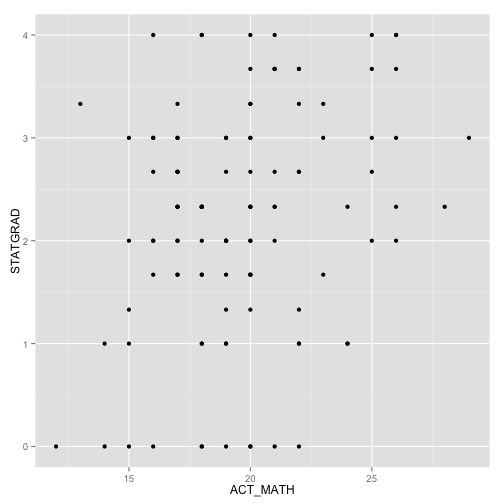 

```r
# That is identical to this
ggplot(aes(x = ACT_MATH, y = STATGRAD), data = precol) + geom_point()
```

```
## Warning: Removed 40 rows containing missing values (geom_point).
```

 

```r
# The advantage of the second line is that you'll often build up and change
# graphs.
g0 <- ggplot(aes(x = HSPR, y = ACT_MATH), data = precol)
g0 + geom_point() + theme_bw()  # let's give it a black and white theme
```

```
## Warning: Removed 55 rows containing missing values (geom_point).
```

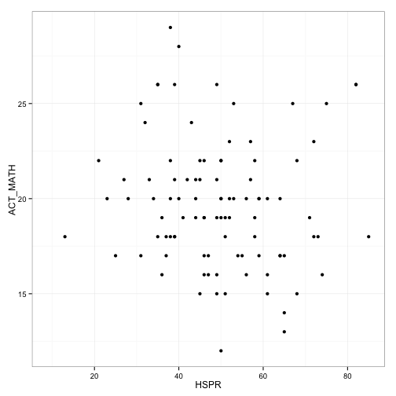 

```r
g0 + geom_point(col = "orange") + theme_bw()  # bw theme and orange points
```

```
## Warning: Removed 55 rows containing missing values (geom_point).
```

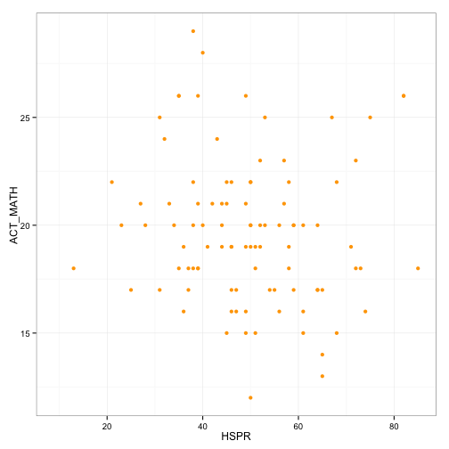 

```r
(g1 <- g0 + geom_point(col = "orange", shape = 2) +
  theme_bw())  # bw theme and orange triangles, () echo
```

```
## Warning: Removed 55 rows containing missing values (geom_point).
```

 

```r
(g1 <- g0 + geom_point(aes(colour = GENDER), shape = 2) +
   theme_bw()) 
```

```
## Warning: Removed 55 rows containing missing values (geom_point).
```

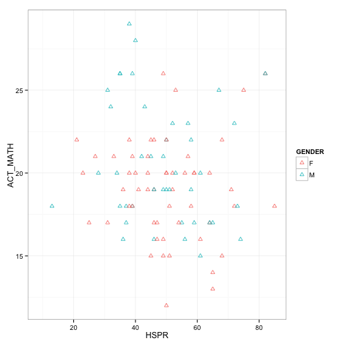 

```r
# Add a best fit
(g2 <- g1 + stat_smooth(aes(color = GENDER),method = "lm", formula = y ~ x))
```

```
## Warning: Removed 31 rows containing missing values (stat_smooth).
## Warning: Removed 24 rows containing missing values (stat_smooth).
## Warning: Removed 55 rows containing missing values (geom_point).
```

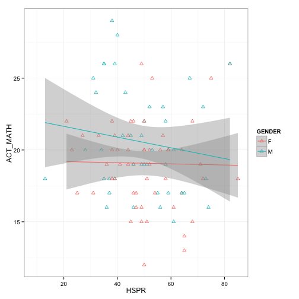 

```r
# And a smoother
g1 + geom_smooth(aes(color = GENDER))  # Linear model is inappropriate?
```

```
## geom_smooth: method="auto" and size of largest group is <1000, so using loess. Use 'method = x' to change the smoothing method.
```

```
## Warning: Removed 31 rows containing missing values (stat_smooth).
## Warning: Removed 24 rows containing missing values (stat_smooth).
## Warning: Removed 55 rows containing missing values (geom_point).
```

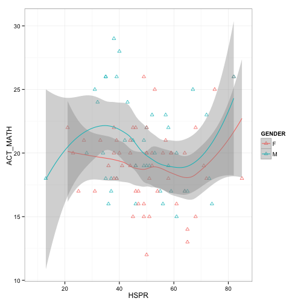 

```r
# Continue to modify the graph and polishing it a little
g2 + xlab("High School Percentile Rank") + ylab("ACT Math") + 
  scale_color_brewer(palette = "Set1") +
  theme(legend.position = "bottom") +
  ggtitle("ACT Math vs. High School Percentile Rank")
```

```
## Warning: Removed 31 rows containing missing values (stat_smooth).
## Warning: Removed 24 rows containing missing values (stat_smooth).
## Warning: Removed 55 rows containing missing values (geom_point).
```

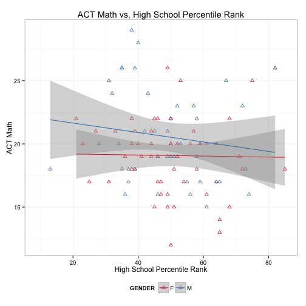 

```r
# Box plot
ggplot(aes(y = HSPR, x = GENDER), data = precol) + geom_boxplot()
```

```
## Warning: Removed 50 rows containing non-finite values (stat_boxplot).
```

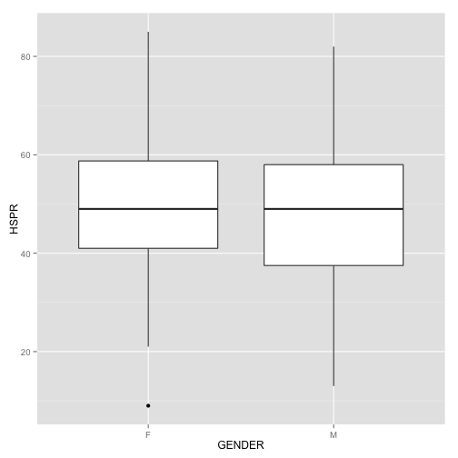 

```r
ggplot(aes(y = HSPR, x = GENDER), data = precol) +
  geom_boxplot(aes(fill = GENDER), outlier.colour = "green" )
```

```
## Warning: Removed 50 rows containing non-finite values (stat_boxplot).
```

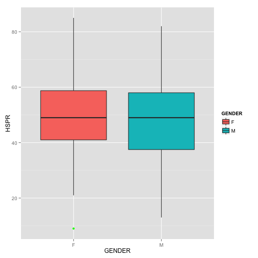 

```r
# Sometimes British English is required 

# Marginal plot of HSPR
ggplot(data = precol, aes(HSPR)) + geom_histogram(fill="white", color = "red") +
  xlab("High School Percentile Rank") + ylab("Frequency")
```

```
## stat_bin: binwidth defaulted to range/30. Use 'binwidth = x' to adjust this.
```

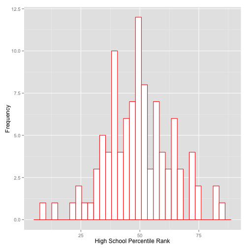 

```r
ggplot(data = precol, aes(HSPR)) + geom_histogram(fill="white", color = "red") +
  xlab("High School Percentile Rank") + ylab("Frequency") + facet_grid(.~GENDER)
```

```
## stat_bin: binwidth defaulted to range/30. Use 'binwidth = x' to adjust this.
## stat_bin: binwidth defaulted to range/30. Use 'binwidth = x' to adjust this.
```

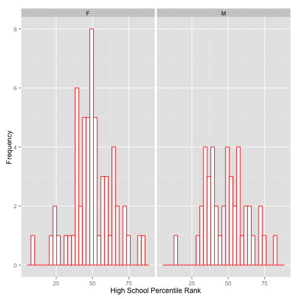 

```r
ggplot(data = precol, aes(HSPR)) + geom_histogram(aes(fill=ETHDESCR), color = "red") +
  xlab("High School Percentile Rank") + ylab("Frequency") + facet_grid(GENDER~ETHDESCR) 
```

```
## stat_bin: binwidth defaulted to range/30. Use 'binwidth = x' to adjust this.
## stat_bin: binwidth defaulted to range/30. Use 'binwidth = x' to adjust this.
## stat_bin: binwidth defaulted to range/30. Use 'binwidth = x' to adjust this.
## stat_bin: binwidth defaulted to range/30. Use 'binwidth = x' to adjust this.
## stat_bin: binwidth defaulted to range/30. Use 'binwidth = x' to adjust this.
## stat_bin: binwidth defaulted to range/30. Use 'binwidth = x' to adjust this.
## stat_bin: binwidth defaulted to range/30. Use 'binwidth = x' to adjust this.
## stat_bin: binwidth defaulted to range/30. Use 'binwidth = x' to adjust this.
## stat_bin: binwidth defaulted to range/30. Use 'binwidth = x' to adjust this.
```

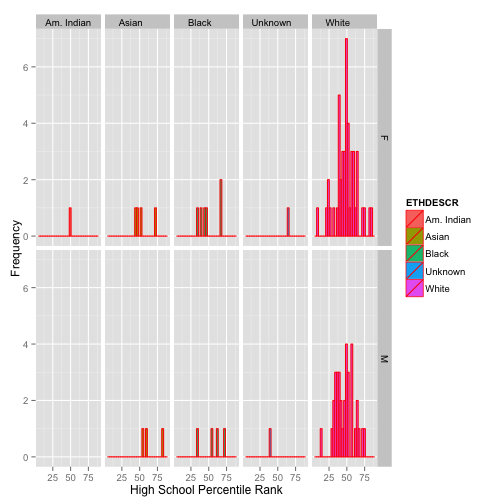 

```r
# Change data type, remember id shouldn't really be numeric
precol$id <- as.factor(precol$id)

# Section should also be a factor
precol$SECTION <- as.factor(precol$SECTION)

# Subset only the continuous variables
numer <- NULL
for(i in 1:ncol(precol)){
  numer[i] <- is.numeric(precol[,i])
}
cont.var <- precol[,numer]
head(cont.var)
```

```
##   CUM_GPA CUMCREDS ACT_TOTL ACT_ENGL ACT_MATH ACT_READ ACT_SCIR HSPR
## 1    2.15    39.00       15       20       14        9       21   65
## 2    2.26    44.00       22       25       19       20       22   52
## 3    1.96    36.00       15       10       18       14       19   NA
## 4    1.77    24.34       NA       NA       NA       NA       NA   NA
## 5    3.60    59.00       25       24       26       25       26   49
## 6      NA    14.00       18       17       17       16       21   65
##   STATGRAD
## 1        1
## 2        2
## 3       NA
## 4       NA
## 5        4
## 6        3
```

```r
# Scatterplot matrix
pairs(cont.var)
```

 

```r
pairs.panels(cont.var)
```

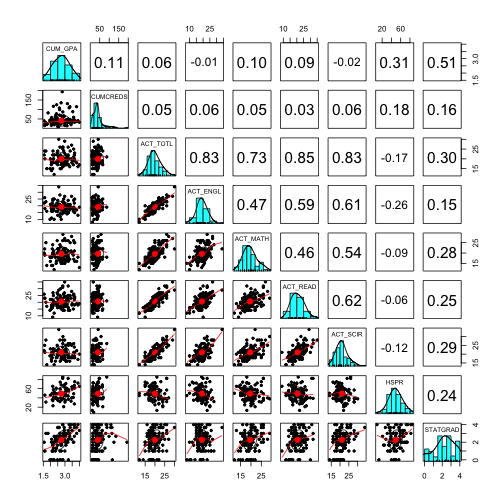 

```r
# Correlation matrix
cor(cont.var)
```

```
##          CUM_GPA CUMCREDS ACT_TOTL ACT_ENGL ACT_MATH ACT_READ ACT_SCIR
## CUM_GPA        1       NA       NA       NA       NA       NA       NA
## CUMCREDS      NA        1       NA       NA       NA       NA       NA
## ACT_TOTL      NA       NA        1       NA       NA       NA       NA
## ACT_ENGL      NA       NA       NA        1       NA       NA       NA
## ACT_MATH      NA       NA       NA       NA        1       NA       NA
## ACT_READ      NA       NA       NA       NA       NA        1       NA
## ACT_SCIR      NA       NA       NA       NA       NA       NA        1
## HSPR          NA       NA       NA       NA       NA       NA       NA
## STATGRAD      NA       NA       NA       NA       NA       NA       NA
##          HSPR STATGRAD
## CUM_GPA    NA       NA
## CUMCREDS   NA       NA
## ACT_TOTL   NA       NA
## ACT_ENGL   NA       NA
## ACT_MATH   NA       NA
## ACT_READ   NA       NA
## ACT_SCIR   NA       NA
## HSPR        1       NA
## STATGRAD   NA        1
```

```r
?cor
cor(cont.var, use = "complete.obs")
```

```
##              CUM_GPA  CUMCREDS    ACT_TOTL    ACT_ENGL    ACT_MATH
## CUM_GPA   1.00000000 0.0879647  0.05220727  0.01526363  0.06896323
## CUMCREDS  0.08796470 1.0000000  0.21338592  0.26369153  0.21857948
## ACT_TOTL  0.05220727 0.2133859  1.00000000  0.77686309  0.75359335
## ACT_ENGL  0.01526363 0.2636915  0.77686309  1.00000000  0.47177553
## ACT_MATH  0.06896323 0.2185795  0.75359335  0.47177553  1.00000000
## ACT_READ  0.08937920 0.0517738  0.82337742  0.48981589  0.45989583
## ACT_SCIR -0.09428355 0.1350198  0.78766918  0.50190355  0.51255180
## HSPR      0.31661807 0.1972108 -0.16887913 -0.27198384 -0.15147432
## STATGRAD  0.49128385 0.2508676  0.25215875  0.16894867  0.29346205
##             ACT_READ    ACT_SCIR        HSPR  STATGRAD
## CUM_GPA   0.08937920 -0.09428355  0.31661807 0.4912839
## CUMCREDS  0.05177380  0.13501978  0.19721083 0.2508676
## ACT_TOTL  0.82337742  0.78766918 -0.16887913 0.2521588
## ACT_ENGL  0.48981589  0.50190355 -0.27198384 0.1689487
## ACT_MATH  0.45989583  0.51255180 -0.15147432 0.2934621
## ACT_READ  1.00000000  0.56935912 -0.05499195 0.1676228
## ACT_SCIR  0.56935912  1.00000000 -0.09182456 0.1679877
## HSPR     -0.05499195 -0.09182456  1.00000000 0.2390232
## STATGRAD  0.16762279  0.16798773  0.23902323 1.0000000
```

```r
# Extra plotting help visit: http://docs.ggplot2.org/current/
# Lots of great stuff there.

#
# Section 4. Regression and ANOVA
#

# t-test
t.test(ACT_MATH~GENDER, data = precol)
```

```
## 
## 	Welch Two Sample t-test
## 
## data:  ACT_MATH by GENDER
## t = -2.4831, df = 102.61, p-value = 0.01465
## alternative hypothesis: true difference in means is not equal to 0
## 95 percent confidence interval:
##  -2.6985987 -0.3019404
## sample estimates:
## mean in group F mean in group M 
##        18.97143        20.47170
```

```r
# As a regression
m0 <- lm(ACT_MATH ~ GENDER, data = precol)
summary(m0)
```

```
## 
## Call:
## lm(formula = ACT_MATH ~ GENDER, data = precol)
## 
## Residuals:
##     Min      1Q  Median      3Q     Max 
## -6.9714 -2.4717 -0.4717  2.0286  8.5283 
## 
## Coefficients:
##             Estimate Std. Error t value Pr(>|t|)    
## (Intercept)  18.9714     0.3886  48.818   <2e-16 ***
## GENDERM       1.5003     0.5920   2.534   0.0125 *  
## ---
## Signif. codes:  0 '***' 0.001 '**' 0.01 '*' 0.05 '.' 0.1 ' ' 1
## 
## Residual standard error: 3.251 on 121 degrees of freedom
##   (28 observations deleted due to missingness)
## Multiple R-squared:  0.0504,	Adjusted R-squared:  0.04255 
## F-statistic: 6.422 on 1 and 121 DF,  p-value: 0.01255
```

```r
precol$white <- ifelse(precol$ETHDESCR == "White     ", "White","Non-White")
table(precol$white)
```

```
## 
## Non-White     White 
##        35       116
```

```r
precol$red.ethnic <- ifelse(precol$ETHDESCR == "White     ", "White",
                            ifelse(precol$ETHDESCR ==  "Black     ", "Black", "Other"))

red.ethnic <- ifelse(precol$ETHDESCR == "White     ", "White",
                     ifelse(precol$ETHDESCR ==  "Black     ", "Black", "Other"))

# Which is of course also a one-factor ANOVA
anova(m0)
```

```
## Analysis of Variance Table
## 
## Response: ACT_MATH
##            Df  Sum Sq Mean Sq F value  Pr(>F)  
## GENDER      1   67.89  67.890   6.422 0.01255 *
## Residuals 121 1279.15  10.571                  
## ---
## Signif. codes:  0 '***' 0.001 '**' 0.01 '*' 0.05 '.' 0.1 ' ' 1
```

```r
# Note, that the p-values were close but not identical. 
t.test(ACT_MATH~GENDER, data = precol, var.equal = TRUE)
```

```
## 
## 	Two Sample t-test
## 
## data:  ACT_MATH by GENDER
## t = -2.5342, df = 121, p-value = 0.01255
## alternative hypothesis: true difference in means is not equal to 0
## 95 percent confidence interval:
##  -2.672322 -0.328217
## sample estimates:
## mean in group F mean in group M 
##        18.97143        20.47170
```

```r
ddply(precol,.(GENDER), summarize,
      variances = var(ACT_MATH, na.rm = T))
```

```
##   GENDER variances
## 1      F  9.216563
## 2      M 12.369376
```

```r
# m0 contains information
str(m0)  # it's a list of 14 items
```

```
## List of 14
##  $ coefficients : Named num [1:2] 19 1.5
##   ..- attr(*, "names")= chr [1:2] "(Intercept)" "GENDERM"
##  $ residuals    : Named num [1:123] -4.9714 0.0286 -2.4717 7.0286 -3.4717 ...
##   ..- attr(*, "names")= chr [1:123] "1" "2" "3" "5" ...
##  $ effects      : Named num [1:123] -217.57 8.24 -2.02 7.41 -3.02 ...
##   ..- attr(*, "names")= chr [1:123] "(Intercept)" "GENDERM" "" "" ...
##  $ rank         : int 2
##  $ fitted.values: Named num [1:123] 19 19 20.5 19 20.5 ...
##   ..- attr(*, "names")= chr [1:123] "1" "2" "3" "5" ...
##  $ assign       : int [1:2] 0 1
##  $ qr           :List of 5
##   ..$ qr   : num [1:123, 1:2] -11.0905 0.0902 0.0902 0.0902 0.0902 ...
##   .. ..- attr(*, "dimnames")=List of 2
##   .. .. ..$ : chr [1:123] "1" "2" "3" "5" ...
##   .. .. ..$ : chr [1:2] "(Intercept)" "GENDERM"
##   .. ..- attr(*, "assign")= int [1:2] 0 1
##   .. ..- attr(*, "contrasts")=List of 1
##   .. .. ..$ GENDER: chr "contr.treatment"
##   ..$ qraux: num [1:2] 1.09 1.07
##   ..$ pivot: int [1:2] 1 2
##   ..$ tol  : num 1e-07
##   ..$ rank : int 2
##   ..- attr(*, "class")= chr "qr"
##  $ df.residual  : int 121
##  $ na.action    :Class 'omit'  Named int [1:28] 4 47 52 53 54 55 71 72 93 123 ...
##   .. ..- attr(*, "names")= chr [1:28] "4" "47" "52" "53" ...
##  $ contrasts    :List of 1
##   ..$ GENDER: chr "contr.treatment"
##  $ xlevels      :List of 1
##   ..$ GENDER: chr [1:2] "F" "M"
##  $ call         : language lm(formula = ACT_MATH ~ GENDER, data = precol)
##  $ terms        :Classes 'terms', 'formula' length 3 ACT_MATH ~ GENDER
##   .. ..- attr(*, "variables")= language list(ACT_MATH, GENDER)
##   .. ..- attr(*, "factors")= int [1:2, 1] 0 1
##   .. .. ..- attr(*, "dimnames")=List of 2
##   .. .. .. ..$ : chr [1:2] "ACT_MATH" "GENDER"
##   .. .. .. ..$ : chr "GENDER"
##   .. ..- attr(*, "term.labels")= chr "GENDER"
##   .. ..- attr(*, "order")= int 1
##   .. ..- attr(*, "intercept")= int 1
##   .. ..- attr(*, "response")= int 1
##   .. ..- attr(*, ".Environment")=<environment: R_GlobalEnv> 
##   .. ..- attr(*, "predvars")= language list(ACT_MATH, GENDER)
##   .. ..- attr(*, "dataClasses")= Named chr [1:2] "numeric" "factor"
##   .. .. ..- attr(*, "names")= chr [1:2] "ACT_MATH" "GENDER"
##  $ model        :'data.frame':	123 obs. of  2 variables:
##   ..$ ACT_MATH: num [1:123] 14 19 18 26 17 22 15 16 19 18 ...
##   ..$ GENDER  : Factor w/ 2 levels "F","M": 1 1 2 1 2 2 1 2 2 1 ...
##   ..- attr(*, "terms")=Classes 'terms', 'formula' length 3 ACT_MATH ~ GENDER
##   .. .. ..- attr(*, "variables")= language list(ACT_MATH, GENDER)
##   .. .. ..- attr(*, "factors")= int [1:2, 1] 0 1
##   .. .. .. ..- attr(*, "dimnames")=List of 2
##   .. .. .. .. ..$ : chr [1:2] "ACT_MATH" "GENDER"
##   .. .. .. .. ..$ : chr "GENDER"
##   .. .. ..- attr(*, "term.labels")= chr "GENDER"
##   .. .. ..- attr(*, "order")= int 1
##   .. .. ..- attr(*, "intercept")= int 1
##   .. .. ..- attr(*, "response")= int 1
##   .. .. ..- attr(*, ".Environment")=<environment: R_GlobalEnv> 
##   .. .. ..- attr(*, "predvars")= language list(ACT_MATH, GENDER)
##   .. .. ..- attr(*, "dataClasses")= Named chr [1:2] "numeric" "factor"
##   .. .. .. ..- attr(*, "names")= chr [1:2] "ACT_MATH" "GENDER"
##   ..- attr(*, "na.action")=Class 'omit'  Named int [1:28] 4 47 52 53 54 55 71 72 93 123 ...
##   .. .. ..- attr(*, "names")= chr [1:28] "4" "47" "52" "53" ...
##  - attr(*, "class")= chr "lm"
```

```r
# Can access these directly
m0$coef
```

```
## (Intercept)     GENDERM 
##    18.97143     1.50027
```

```r
m0$residuals
```

```
##           1           2           3           5           6           7 
## -4.97142857  0.02857143 -2.47169811  7.02857143 -3.47169811  1.52830189 
##           8           9          10          11          12          13 
## -3.97142857 -4.47169811 -1.47169811 -0.97142857 -3.47169811 -3.97142857 
##          14          15          16          17          18          19 
## -5.97142857 -0.97142857 -2.47169811 -1.97142857 -5.47169811 -1.47169811 
##          20          21          22          23          24          25 
##  6.02857143 -2.47169811  3.02857143 -2.47169811 -2.97142857  3.02857143 
##          26          27          28          29          30          31 
##  2.02857143 -1.47169811 -4.47169811 -2.47169811 -1.47169811 -4.47169811 
##          32          33          34          35          36          37 
##  0.02857143  1.02857143  1.52830189  4.52830189  1.02857143  1.52830189 
##          38          39          40          41          42          43 
##  0.52830189  0.02857143  2.02857143 -6.97142857 -1.97142857  1.02857143 
##          44          45          46          48          49          50 
##  2.02857143 -1.47169811 -2.47169811 -0.47169811 -0.47169811  0.52830189 
##          51          56          57          58          59          60 
## -1.97142857  1.02857143 -0.97142857  1.02857143  1.02857143  5.52830189 
##          61          62          63          64          65          66 
##  0.52830189  0.52830189 -0.97142857  2.02857143 -2.47169811  3.52830189 
##          67          68          69          70          73          74 
##  2.52830189 -1.97142857  1.02857143  1.02857143 -4.97142857 -0.47169811 
##          75          76          77          78          79          80 
##  3.02857143  1.52830189 -0.97142857  2.52830189 -3.47169811  3.02857143 
##          81          82          83          84          85          86 
## -0.97142857  1.02857143  0.02857143 -2.97142857  0.02857143  3.52830189 
##          87          88          89          90          91          92 
##  2.52830189  1.02857143 -1.97142857 -1.97142857 -0.47169811  6.52830189 
##          94          95          96          97          98          99 
## -1.47169811 -3.97142857  8.52830189 -0.97142857  5.52830189 -1.97142857 
##         100         101         102         103         104         105 
## -0.97142857  1.02857143 -0.47169811 -1.97142857 -4.47169811  1.02857143 
##         106         107         108         109         110         111 
## -3.47169811 -4.47169811 -4.97142857 -3.97142857 -3.47169811  3.02857143 
##         112         113         114         115         116         117 
## -1.97142857  5.02857143 -2.97142857  7.52830189 -0.47169811  4.52830189 
##         118         119         120         121         122         125 
##  3.02857143 -2.97142857  2.02857143 -2.47169811  2.02857143  7.02857143 
##         126         130         131         140         141         142 
## -0.97142857  6.02857143 -0.97142857  3.02857143  6.02857143  0.02857143 
##         143         149         151 
##  5.52830189  5.52830189  0.02857143
```

```r
# Or through R commands
coef(m0)
```

```
## (Intercept)     GENDERM 
##    18.97143     1.50027
```

```r
print(residuals(m0), digits = 2)
```

```
##      1      2      3      5      6      7      8      9     10     11 
## -4.971  0.029 -2.472  7.029 -3.472  1.528 -3.971 -4.472 -1.472 -0.971 
##     12     13     14     15     16     17     18     19     20     21 
## -3.472 -3.971 -5.971 -0.971 -2.472 -1.971 -5.472 -1.472  6.029 -2.472 
##     22     23     24     25     26     27     28     29     30     31 
##  3.029 -2.472 -2.971  3.029  2.029 -1.472 -4.472 -2.472 -1.472 -4.472 
##     32     33     34     35     36     37     38     39     40     41 
##  0.029  1.029  1.528  4.528  1.029  1.528  0.528  0.029  2.029 -6.971 
##     42     43     44     45     46     48     49     50     51     56 
## -1.971  1.029  2.029 -1.472 -2.472 -0.472 -0.472  0.528 -1.971  1.029 
##     57     58     59     60     61     62     63     64     65     66 
## -0.971  1.029  1.029  5.528  0.528  0.528 -0.971  2.029 -2.472  3.528 
##     67     68     69     70     73     74     75     76     77     78 
##  2.528 -1.971  1.029  1.029 -4.971 -0.472  3.029  1.528 -0.971  2.528 
##     79     80     81     82     83     84     85     86     87     88 
## -3.472  3.029 -0.971  1.029  0.029 -2.971  0.029  3.528  2.528  1.029 
##     89     90     91     92     94     95     96     97     98     99 
## -1.971 -1.971 -0.472  6.528 -1.472 -3.971  8.528 -0.971  5.528 -1.971 
##    100    101    102    103    104    105    106    107    108    109 
## -0.971  1.029 -0.472 -1.971 -4.472  1.029 -3.472 -4.472 -4.971 -3.971 
##    110    111    112    113    114    115    116    117    118    119 
## -3.472  3.029 -1.971  5.029 -2.971  7.528 -0.472  4.528  3.029 -2.971 
##    120    121    122    125    126    130    131    140    141    142 
##  2.029 -2.472  2.029  7.029 -0.971  6.029 -0.971  3.029  6.029  0.029 
##    143    149    151 
##  5.528  5.528  0.029
```

```r
# You can get a lot of diagnostic information from plotting model
plot(m0)
```

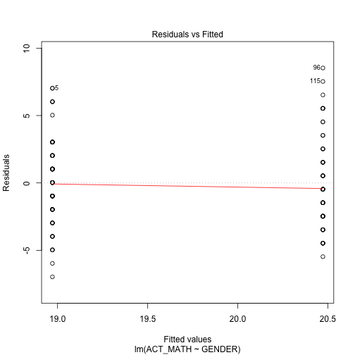 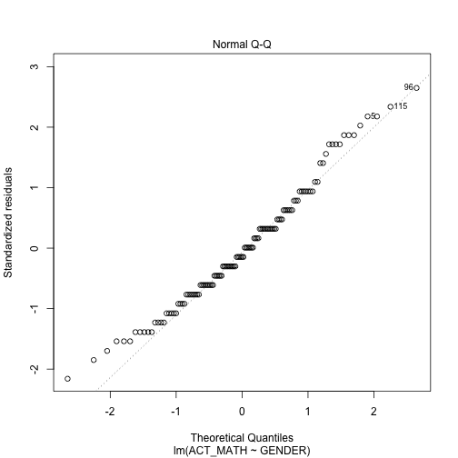 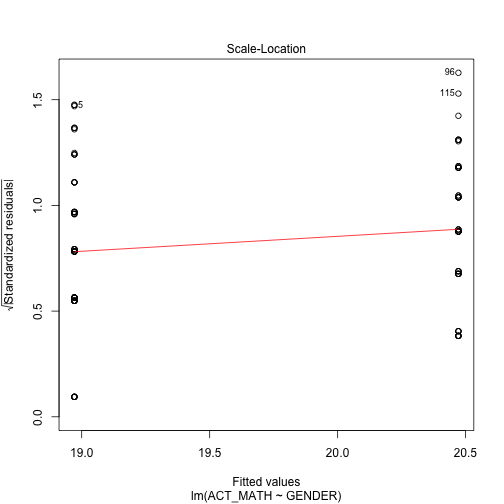 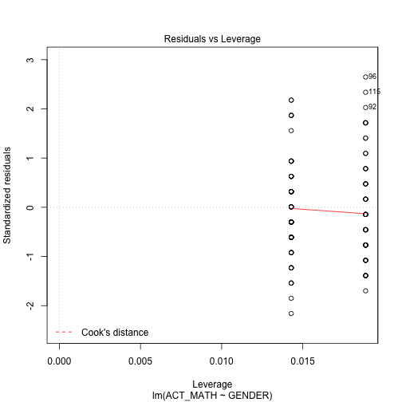 

```r
# Simple linear regression
m1 <- lm(CUM_GPA ~ ACT_TOTL, data = precol)
summary(m1)
```

```
## 
## Call:
## lm(formula = CUM_GPA ~ ACT_TOTL, data = precol)
## 
## Residuals:
##      Min       1Q   Median       3Q      Max 
## -1.23664 -0.35169  0.02341  0.34582  1.25330 
## 
## Coefficients:
##             Estimate Std. Error t value Pr(>|t|)    
## (Intercept) 2.576924   0.348875   7.386 6.05e-11 ***
## ACT_TOTL    0.009987   0.017328   0.576    0.566    
## ---
## Signif. codes:  0 '***' 0.001 '**' 0.01 '*' 0.05 '.' 0.1 ' ' 1
## 
## Residual standard error: 0.5565 on 94 degrees of freedom
##   (55 observations deleted due to missingness)
## Multiple R-squared:  0.003521,	Adjusted R-squared:  -0.00708 
## F-statistic: 0.3322 on 1 and 94 DF,  p-value: 0.5658
```

```r
plot(m1)  # model looks pretty reasonable
```

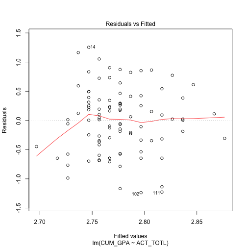 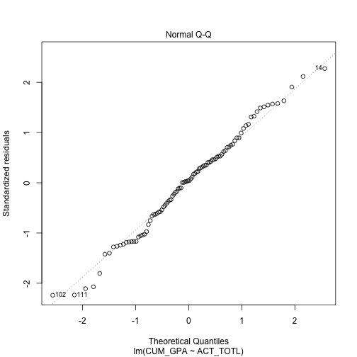 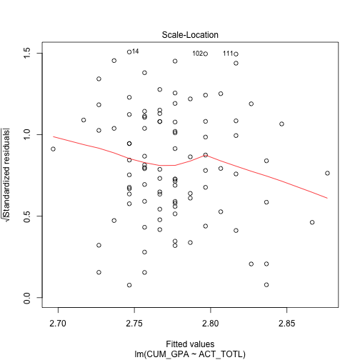 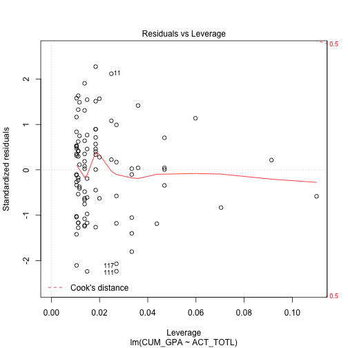 

```r
# Box-Cox transformation
library(MASS)
boxcox(m1)
```

 

```r
# Multiple regression
m2 <- lm(CUM_GPA ~ HSPR + STATGRAD, data = precol)
summary(m2)
```

```
## 
## Call:
## lm(formula = CUM_GPA ~ HSPR + STATGRAD, data = precol)
## 
## Residuals:
##      Min       1Q   Median       3Q      Max 
## -1.18483 -0.34647  0.03275  0.32516  0.84979 
## 
## Coefficients:
##             Estimate Std. Error t value Pr(>|t|)    
## (Intercept) 1.976079   0.211347   9.350 1.04e-13 ***
## HSPR        0.007949   0.003852   2.063 0.043013 *  
## STATGRAD    0.214113   0.053193   4.025 0.000149 ***
## ---
## Signif. codes:  0 '***' 0.001 '**' 0.01 '*' 0.05 '.' 0.1 ' ' 1
## 
## Residual standard error: 0.4438 on 66 degrees of freedom
##   (82 observations deleted due to missingness)
## Multiple R-squared:  0.2814,	Adjusted R-squared:  0.2596 
## F-statistic: 12.92 on 2 and 66 DF,  p-value: 1.838e-05
```

```r
# ANOVA
m3 <- lm(CUM_GPA ~ GENDER + ETHDESCR + GENDER*ETHDESCR, data = precol)
anova(m3)
```

```
## Analysis of Variance Table
## 
## Response: CUM_GPA
##                  Df Sum Sq Mean Sq F value Pr(>F)
## GENDER            1  0.775 0.77493  2.5467 0.1134
## ETHDESCR          4  0.469 0.11735  0.3856 0.8185
## GENDER:ETHDESCR   3  1.574 0.52466  1.7242 0.1663
## Residuals       109 33.168 0.30429
```

```r
# Fit the model with everything in it except STATGRAD and id
m4 <- lm(CUM_GPA ~ . - id - STATGRAD, data = precol)
summary(m4)
```

```
## 
## Call:
## lm(formula = CUM_GPA ~ . - id - STATGRAD, data = precol)
## 
## Residuals:
##      Min       1Q   Median       3Q      Max 
## -0.97673 -0.16582  0.04528  0.21324  0.69706 
## 
## Coefficients: (3 not defined because of singularities)
##                     Estimate Std. Error t value Pr(>|t|)  
## (Intercept)         2.637913   1.027439   2.567   0.0143 *
## SECTION2           -0.034124   0.265134  -0.129   0.8983  
## SECTION3           -0.161716   0.295893  -0.547   0.5879  
## SECTION4           -0.212368   0.293366  -0.724   0.4736  
## SECTION5           -0.293227   0.269980  -1.086   0.2843  
## GENDERM            -0.027438   0.178192  -0.154   0.8784  
## ETHDESCRAsian       0.870829   0.780790   1.115   0.2717  
## ETHDESCRBlack       0.595415   0.677320   0.879   0.3849  
## ETHDESCRUnknown     0.903290   0.795940   1.135   0.2635  
## ETHDESCRWhite       0.711117   0.674231   1.055   0.2982  
## CUMCREDS           -0.002630   0.006887  -0.382   0.7047  
## ACT_TOTL            0.309386   0.249668   1.239   0.2229  
## ACT_ENGL           -0.078697   0.075648  -1.040   0.3048  
## ACT_MATH           -0.067803   0.064948  -1.044   0.3031  
## ACT_READ           -0.064100   0.067285  -0.953   0.3468  
## ACT_SCIR           -0.105984   0.068455  -1.548   0.1299  
## HSPR                0.004691   0.006066   0.773   0.4441  
## LTRGRADEA-         -0.093871   0.393518  -0.239   0.8127  
## LTRGRADEB          -0.411049   0.316229  -1.300   0.2015  
## LTRGRADEB-         -0.284640   0.316650  -0.899   0.3744  
## LTRGRADEB+          0.186432   0.323653   0.576   0.5680  
## LTRGRADEC          -0.327261   0.301462  -1.086   0.2845  
## LTRGRADEC-         -0.665072   0.352462  -1.887   0.0668 .
## LTRGRADEC+         -0.377904   0.298515  -1.266   0.2132  
## LTRGRADED          -0.799500   0.343801  -2.325   0.0255 *
## LTRGRADED+         -1.001244   0.502456  -1.993   0.0535 .
## LTRGRADEF          -0.544365   0.450160  -1.209   0.2340  
## LTRGRADEN           0.034141   0.629261   0.054   0.9570  
## DEVSTDNTYES         0.149555   0.273293   0.547   0.5874  
## whiteWhite                NA         NA      NA       NA  
## red.ethnicOther           NA         NA      NA       NA  
## red.ethnicWhite           NA         NA      NA       NA  
## ---
## Signif. codes:  0 '***' 0.001 '**' 0.01 '*' 0.05 '.' 0.1 ' ' 1
## 
## Residual standard error: 0.4726 on 38 degrees of freedom
##   (84 observations deleted due to missingness)
## Multiple R-squared:  0.5226,	Adjusted R-squared:  0.1709 
## F-statistic: 1.486 on 28 and 38 DF,  p-value: 0.1269
```

```r
# Do stepwise selection, but can't have missing data
# Omit missing data
precol.m <- na.omit(precol)
m5 <- lm(CUM_GPA ~ . - id - STATGRAD, data = precol.m)

# Stepwise (unwise) selection
step.mod <- stepAIC(m5)
```

```
## Start:  AIC=-80.42
## CUM_GPA ~ (SECTION + GENDER + ETHDESCR + CUMCREDS + ACT_TOTL + 
##     ACT_ENGL + ACT_MATH + ACT_READ + ACT_SCIR + HSPR + LTRGRADE + 
##     STATGRAD + DEVSTDNT + id + white + red.ethnic) - id - STATGRAD
## 
## 
## Step:  AIC=-80.42
## CUM_GPA ~ SECTION + GENDER + ETHDESCR + CUMCREDS + ACT_TOTL + 
##     ACT_ENGL + ACT_MATH + ACT_READ + ACT_SCIR + HSPR + LTRGRADE + 
##     DEVSTDNT + white
## 
## 
## Step:  AIC=-80.42
## CUM_GPA ~ SECTION + GENDER + ETHDESCR + CUMCREDS + ACT_TOTL + 
##     ACT_ENGL + ACT_MATH + ACT_READ + ACT_SCIR + HSPR + LTRGRADE + 
##     DEVSTDNT
## 
##            Df Sum of Sq     RSS     AIC
## - ETHDESCR  4    0.3380  8.8260 -85.808
## - SECTION   4    0.4990  8.9871 -84.597
## - GENDER    1    0.0053  8.4934 -82.382
## - CUMCREDS  1    0.0326  8.5206 -82.168
## - DEVSTDNT  1    0.0669  8.5550 -81.898
## - HSPR      1    0.1336  8.6217 -81.378
## - ACT_READ  1    0.2027  8.6908 -80.843
## - ACT_ENGL  1    0.2417  8.7298 -80.543
## - ACT_MATH  1    0.2434  8.7315 -80.530
## <none>                   8.4881 -80.424
## - ACT_TOTL  1    0.3430  8.8311 -79.770
## - LTRGRADE 11    3.5702 12.0582 -78.901
## - ACT_SCIR  1    0.5354  9.0235 -78.326
## 
## Step:  AIC=-85.81
## CUM_GPA ~ SECTION + GENDER + CUMCREDS + ACT_TOTL + ACT_ENGL + 
##     ACT_MATH + ACT_READ + ACT_SCIR + HSPR + LTRGRADE + DEVSTDNT
## 
##            Df Sum of Sq     RSS     AIC
## - SECTION   4    0.5455  9.3715 -89.790
## - GENDER    1    0.0002  8.8262 -87.807
## - CUMCREDS  1    0.0071  8.8331 -87.754
## - ACT_READ  1    0.0553  8.8813 -87.390
## - ACT_MATH  1    0.0941  8.9201 -87.098
## - ACT_ENGL  1    0.1097  8.9358 -86.980
## - DEVSTDNT  1    0.1289  8.9549 -86.837
## - ACT_TOTL  1    0.1654  8.9915 -86.564
## - HSPR      1    0.2459  9.0719 -85.967
## <none>                   8.8260 -85.808
## - ACT_SCIR  1    0.3501  9.1761 -85.202
## - LTRGRADE 11    4.5994 13.4254 -79.706
## 
## Step:  AIC=-89.79
## CUM_GPA ~ GENDER + CUMCREDS + ACT_TOTL + ACT_ENGL + ACT_MATH + 
##     ACT_READ + ACT_SCIR + HSPR + LTRGRADE + DEVSTDNT
## 
##            Df Sum of Sq     RSS     AIC
## - GENDER    1    0.0018  9.3733 -91.777
## - ACT_READ  1    0.0155  9.3870 -91.680
## - ACT_ENGL  1    0.0356  9.4071 -91.536
## - CUMCREDS  1    0.0470  9.4185 -91.455
## - ACT_MATH  1    0.0568  9.4283 -91.385
## - DEVSTDNT  1    0.0626  9.4341 -91.344
## - ACT_TOTL  1    0.0887  9.4602 -91.159
## - ACT_SCIR  1    0.2144  9.5859 -90.275
## <none>                   9.3715 -89.790
## - HSPR      1    0.3477  9.7192 -89.349
## - LTRGRADE 11    4.6796 14.0511 -84.653
## 
## Step:  AIC=-91.78
## CUM_GPA ~ CUMCREDS + ACT_TOTL + ACT_ENGL + ACT_MATH + ACT_READ + 
##     ACT_SCIR + HSPR + LTRGRADE + DEVSTDNT
## 
##            Df Sum of Sq     RSS     AIC
## - ACT_READ  1    0.0189  9.3922 -93.643
## - ACT_ENGL  1    0.0363  9.4096 -93.518
## - CUMCREDS  1    0.0452  9.4185 -93.455
## - DEVSTDNT  1    0.0616  9.4349 -93.338
## - ACT_MATH  1    0.0694  9.4427 -93.283
## - ACT_TOTL  1    0.0959  9.4692 -93.095
## - ACT_SCIR  1    0.2351  9.6084 -92.118
## <none>                   9.3733 -91.777
## - HSPR      1    0.3464  9.7197 -91.346
## - LTRGRADE 11    4.9576 14.3309 -85.332
## 
## Step:  AIC=-93.64
## CUM_GPA ~ CUMCREDS + ACT_TOTL + ACT_ENGL + ACT_MATH + ACT_SCIR + 
##     HSPR + LTRGRADE + DEVSTDNT
## 
##            Df Sum of Sq     RSS     AIC
## - ACT_ENGL  1    0.0186  9.4108 -95.510
## - CUMCREDS  1    0.0415  9.4337 -95.347
## - DEVSTDNT  1    0.0538  9.4460 -95.260
## - ACT_MATH  1    0.0779  9.4700 -95.090
## - ACT_TOTL  1    0.2661  9.6583 -93.771
## <none>                   9.3922 -93.643
## - HSPR      1    0.3375  9.7296 -93.278
## - ACT_SCIR  1    0.3745  9.7667 -93.023
## - LTRGRADE 11    5.1494 14.5416 -86.355
## 
## Step:  AIC=-95.51
## CUM_GPA ~ CUMCREDS + ACT_TOTL + ACT_MATH + ACT_SCIR + HSPR + 
##     LTRGRADE + DEVSTDNT
## 
##            Df Sum of Sq     RSS     AIC
## - DEVSTDNT  1    0.0478  9.4585 -97.171
## - ACT_MATH  1    0.0593  9.4701 -97.089
## - CUMCREDS  1    0.0599  9.4707 -97.085
## <none>                   9.4108 -95.510
## - ACT_SCIR  1    0.3829  9.7936 -94.838
## - HSPR      1    0.3910  9.8017 -94.783
## - ACT_TOTL  1    0.4268  9.8375 -94.539
## - LTRGRADE 11    5.1498 14.5605 -88.267
## 
## Step:  AIC=-97.17
## CUM_GPA ~ CUMCREDS + ACT_TOTL + ACT_MATH + ACT_SCIR + HSPR + 
##     LTRGRADE
## 
##            Df Sum of Sq     RSS     AIC
## - ACT_MATH  1    0.0493  9.5079 -98.822
## - CUMCREDS  1    0.1296  9.5882 -98.259
## <none>                   9.4585 -97.171
## - ACT_SCIR  1    0.3397  9.7982 -96.807
## - HSPR      1    0.3436  9.8021 -96.781
## - ACT_TOTL  1    0.3790  9.8376 -96.539
## - LTRGRADE 11    5.2792 14.7377 -89.457
## 
## Step:  AIC=-98.82
## CUM_GPA ~ CUMCREDS + ACT_TOTL + ACT_SCIR + HSPR + LTRGRADE
## 
##            Df Sum of Sq     RSS     AIC
## - CUMCREDS  1    0.1427  9.6505 -99.825
## <none>                   9.5079 -98.822
## - ACT_SCIR  1    0.3021  9.8099 -98.727
## - HSPR      1    0.3555  9.8634 -98.363
## - ACT_TOTL  1    0.3741  9.8819 -98.237
## - LTRGRADE 11    5.2321 14.7400 -91.447
## 
## Step:  AIC=-99.82
## CUM_GPA ~ ACT_TOTL + ACT_SCIR + HSPR + LTRGRADE
## 
##            Df Sum of Sq     RSS     AIC
## <none>                   9.6505 -99.825
## - ACT_SCIR  1    0.2931  9.9436 -99.820
## - HSPR      1    0.2962  9.9467 -99.799
## - ACT_TOTL  1    0.3203  9.9708 -99.637
## - LTRGRADE 11    5.0961 14.7466 -93.416
```

```r
summary(step.mod)
```

```
## 
## Call:
## lm(formula = CUM_GPA ~ ACT_TOTL + ACT_SCIR + HSPR + LTRGRADE, 
##     data = precol.m)
## 
## Residuals:
##      Min       1Q   Median       3Q      Max 
## -0.88970 -0.22897  0.03793  0.21370  0.71662 
## 
## Coefficients:
##              Estimate Std. Error t value Pr(>|t|)    
## (Intercept)  2.914828   0.590719   4.934 8.66e-06 ***
## ACT_TOTL     0.040577   0.030887   1.314  0.19471    
## ACT_SCIR    -0.034555   0.027496  -1.257  0.21446    
## HSPR         0.005783   0.004578   1.263  0.21210    
## LTRGRADEA-  -0.159722   0.333451  -0.479  0.63395    
## LTRGRADEB   -0.530705   0.244403  -2.171  0.03448 *  
## LTRGRADEB-  -0.333951   0.251379  -1.328  0.18982    
## LTRGRADEB+   0.114553   0.266849   0.429  0.66949    
## LTRGRADEC   -0.356373   0.224792  -1.585  0.11895    
## LTRGRADEC-  -0.639013   0.281018  -2.274  0.02713 *  
## LTRGRADEC+  -0.435304   0.238125  -1.828  0.07328 .  
## LTRGRADED   -0.897956   0.258767  -3.470  0.00105 ** 
## LTRGRADED+  -0.974678   0.358938  -2.715  0.00896 ** 
## LTRGRADEF   -0.684125   0.324930  -2.105  0.04010 *  
## LTRGRADEN   -0.066504   0.472680  -0.141  0.88865    
## ---
## Signif. codes:  0 '***' 0.001 '**' 0.01 '*' 0.05 '.' 0.1 ' ' 1
## 
## Residual standard error: 0.4308 on 52 degrees of freedom
## Multiple R-squared:  0.4573,	Adjusted R-squared:  0.3111 
## F-statistic: 3.129 on 14 and 52 DF,  p-value: 0.001385
```

```r
#
# Section 5. Multiple imputation
#
# http://www.stefvanbuuren.nl/publications/MICE%20in%20R%20-%20Draft.pdf
library(mice)   
```

```
## Loading required package: Rcpp
## Loading required package: lattice
## mice 2.22 2014-06-10
```

```r
# Pattern of missingness
md.pattern(precol)  
```

```
## Warning: NAs introduced by coercion
## Warning: NAs introduced by coercion
```

```
##    SECTION GENDER ETHDESCR CUMCREDS LTRGRADE DEVSTDNT id STATGRAD ACT_TOTL
## 67       1      1        1        1        1        1  1        1        1
## 25       1      1        1        1        1        1  1        1        1
## 17       1      1        1        1        1        1  1        1        1
##  4       1      1        1        1        1        1  1        0        1
##  2       1      1        1        1        1        1  1        1        1
##  8       1      1        1        1        1        1  1        0        1
##  2       1      1        1        1        1        1  1        1        0
##  2       1      1        1        1        1        1  1        1        0
## 16       1      1        1        1        1        1  1        1        0
##  3       1      1        1        1        1        1  1        1        0
##  1       1      1        1        1        1        1  1        0        0
##  4       1      1        1        1        1        1  1        0        0
##          0      0        0        0        0        0  0       17       28
##    ACT_ENGL ACT_MATH ACT_READ ACT_SCIR CUM_GPA HSPR white red.ethnic    
## 67        1        1        1        1       1    1     0          0   2
## 25        1        1        1        1       0    1     0          0   3
## 17        1        1        1        1       1    0     0          0   3
##  4        1        1        1        1       1    1     0          0   3
##  2        1        1        1        1       0    0     0          0   4
##  8        1        1        1        1       1    0     0          0   4
##  2        0        0        0        0       1    1     0          0   7
##  2        0        0        0        0       0    1     0          0   8
## 16        0        0        0        0       1    0     0          0   8
##  3        0        0        0        0       0    0     0          0   9
##  1        0        0        0        0       0    1     0          0   9
##  4        0        0        0        0       1    0     0          0   9
##          28       28       28       28      33   50   151        151 542
```

```r
# This is a way to look and see if missingness may be related btwn variables
md.pairs(precol)
```

```
## $rr
##            SECTION GENDER ETHDESCR CUM_GPA CUMCREDS ACT_TOTL ACT_ENGL
## SECTION        151    151      151     118      151      123      123
## GENDER         151    151      151     118      151      123      123
## ETHDESCR       151    151      151     118      151      123      123
## CUM_GPA        118    118      118     118      118       96       96
## CUMCREDS       151    151      151     118      151      123      123
## ACT_TOTL       123    123      123      96      123      123      123
## ACT_ENGL       123    123      123      96      123      123      123
## ACT_MATH       123    123      123      96      123      123      123
## ACT_READ       123    123      123      96      123      123      123
## ACT_SCIR       123    123      123      96      123      123      123
## HSPR           101    101      101      73      101       96       96
## LTRGRADE       151    151      151     118      151      123      123
## STATGRAD       134    134      134     102      134      111      111
## DEVSTDNT       151    151      151     118      151      123      123
## id             151    151      151     118      151      123      123
## white          151    151      151     118      151      123      123
## red.ethnic     151    151      151     118      151      123      123
##            ACT_MATH ACT_READ ACT_SCIR HSPR LTRGRADE STATGRAD DEVSTDNT  id
## SECTION         123      123      123  101      151      134      151 151
## GENDER          123      123      123  101      151      134      151 151
## ETHDESCR        123      123      123  101      151      134      151 151
## CUM_GPA          96       96       96   73      118      102      118 118
## CUMCREDS        123      123      123  101      151      134      151 151
## ACT_TOTL        123      123      123   96      123      111      123 123
## ACT_ENGL        123      123      123   96      123      111      123 123
## ACT_MATH        123      123      123   96      123      111      123 123
## ACT_READ        123      123      123   96      123      111      123 123
## ACT_SCIR        123      123      123   96      123      111      123 123
## HSPR             96       96       96  101      101       96      101 101
## LTRGRADE        123      123      123  101      151      134      151 151
## STATGRAD        111      111      111   96      134      134      134 134
## DEVSTDNT        123      123      123  101      151      134      151 151
## id              123      123      123  101      151      134      151 151
## white           123      123      123  101      151      134      151 151
## red.ethnic      123      123      123  101      151      134      151 151
##            white red.ethnic
## SECTION      151        151
## GENDER       151        151
## ETHDESCR     151        151
## CUM_GPA      118        118
## CUMCREDS     151        151
## ACT_TOTL     123        123
## ACT_ENGL     123        123
## ACT_MATH     123        123
## ACT_READ     123        123
## ACT_SCIR     123        123
## HSPR         101        101
## LTRGRADE     151        151
## STATGRAD     134        134
## DEVSTDNT     151        151
## id           151        151
## white        151        151
## red.ethnic   151        151
## 
## $rm
##            SECTION GENDER ETHDESCR CUM_GPA CUMCREDS ACT_TOTL ACT_ENGL
## SECTION          0      0        0      33        0       28       28
## GENDER           0      0        0      33        0       28       28
## ETHDESCR         0      0        0      33        0       28       28
## CUM_GPA          0      0        0       0        0       22       22
## CUMCREDS         0      0        0      33        0       28       28
## ACT_TOTL         0      0        0      27        0        0        0
## ACT_ENGL         0      0        0      27        0        0        0
## ACT_MATH         0      0        0      27        0        0        0
## ACT_READ         0      0        0      27        0        0        0
## ACT_SCIR         0      0        0      27        0        0        0
## HSPR             0      0        0      28        0        5        5
## LTRGRADE         0      0        0      33        0       28       28
## STATGRAD         0      0        0      32        0       23       23
## DEVSTDNT         0      0        0      33        0       28       28
## id               0      0        0      33        0       28       28
## white            0      0        0      33        0       28       28
## red.ethnic       0      0        0      33        0       28       28
##            ACT_MATH ACT_READ ACT_SCIR HSPR LTRGRADE STATGRAD DEVSTDNT id
## SECTION          28       28       28   50        0       17        0  0
## GENDER           28       28       28   50        0       17        0  0
## ETHDESCR         28       28       28   50        0       17        0  0
## CUM_GPA          22       22       22   45        0       16        0  0
## CUMCREDS         28       28       28   50        0       17        0  0
## ACT_TOTL          0        0        0   27        0       12        0  0
## ACT_ENGL          0        0        0   27        0       12        0  0
## ACT_MATH          0        0        0   27        0       12        0  0
## ACT_READ          0        0        0   27        0       12        0  0
## ACT_SCIR          0        0        0   27        0       12        0  0
## HSPR              5        5        5    0        0        5        0  0
## LTRGRADE         28       28       28   50        0       17        0  0
## STATGRAD         23       23       23   38        0        0        0  0
## DEVSTDNT         28       28       28   50        0       17        0  0
## id               28       28       28   50        0       17        0  0
## white            28       28       28   50        0       17        0  0
## red.ethnic       28       28       28   50        0       17        0  0
##            white red.ethnic
## SECTION        0          0
## GENDER         0          0
## ETHDESCR       0          0
## CUM_GPA        0          0
## CUMCREDS       0          0
## ACT_TOTL       0          0
## ACT_ENGL       0          0
## ACT_MATH       0          0
## ACT_READ       0          0
## ACT_SCIR       0          0
## HSPR           0          0
## LTRGRADE       0          0
## STATGRAD       0          0
## DEVSTDNT       0          0
## id             0          0
## white          0          0
## red.ethnic     0          0
## 
## $mr
##            SECTION GENDER ETHDESCR CUM_GPA CUMCREDS ACT_TOTL ACT_ENGL
## SECTION          0      0        0       0        0        0        0
## GENDER           0      0        0       0        0        0        0
## ETHDESCR         0      0        0       0        0        0        0
## CUM_GPA         33     33       33       0       33       27       27
## CUMCREDS         0      0        0       0        0        0        0
## ACT_TOTL        28     28       28      22       28        0        0
## ACT_ENGL        28     28       28      22       28        0        0
## ACT_MATH        28     28       28      22       28        0        0
## ACT_READ        28     28       28      22       28        0        0
## ACT_SCIR        28     28       28      22       28        0        0
## HSPR            50     50       50      45       50       27       27
## LTRGRADE         0      0        0       0        0        0        0
## STATGRAD        17     17       17      16       17       12       12
## DEVSTDNT         0      0        0       0        0        0        0
## id               0      0        0       0        0        0        0
## white            0      0        0       0        0        0        0
## red.ethnic       0      0        0       0        0        0        0
##            ACT_MATH ACT_READ ACT_SCIR HSPR LTRGRADE STATGRAD DEVSTDNT id
## SECTION           0        0        0    0        0        0        0  0
## GENDER            0        0        0    0        0        0        0  0
## ETHDESCR          0        0        0    0        0        0        0  0
## CUM_GPA          27       27       27   28       33       32       33 33
## CUMCREDS          0        0        0    0        0        0        0  0
## ACT_TOTL          0        0        0    5       28       23       28 28
## ACT_ENGL          0        0        0    5       28       23       28 28
## ACT_MATH          0        0        0    5       28       23       28 28
## ACT_READ          0        0        0    5       28       23       28 28
## ACT_SCIR          0        0        0    5       28       23       28 28
## HSPR             27       27       27    0       50       38       50 50
## LTRGRADE          0        0        0    0        0        0        0  0
## STATGRAD         12       12       12    5       17        0       17 17
## DEVSTDNT          0        0        0    0        0        0        0  0
## id                0        0        0    0        0        0        0  0
## white             0        0        0    0        0        0        0  0
## red.ethnic        0        0        0    0        0        0        0  0
##            white red.ethnic
## SECTION        0          0
## GENDER         0          0
## ETHDESCR       0          0
## CUM_GPA       33         33
## CUMCREDS       0          0
## ACT_TOTL      28         28
## ACT_ENGL      28         28
## ACT_MATH      28         28
## ACT_READ      28         28
## ACT_SCIR      28         28
## HSPR          50         50
## LTRGRADE       0          0
## STATGRAD      17         17
## DEVSTDNT       0          0
## id             0          0
## white          0          0
## red.ethnic     0          0
## 
## $mm
##            SECTION GENDER ETHDESCR CUM_GPA CUMCREDS ACT_TOTL ACT_ENGL
## SECTION          0      0        0       0        0        0        0
## GENDER           0      0        0       0        0        0        0
## ETHDESCR         0      0        0       0        0        0        0
## CUM_GPA          0      0        0      33        0        6        6
## CUMCREDS         0      0        0       0        0        0        0
## ACT_TOTL         0      0        0       6        0       28       28
## ACT_ENGL         0      0        0       6        0       28       28
## ACT_MATH         0      0        0       6        0       28       28
## ACT_READ         0      0        0       6        0       28       28
## ACT_SCIR         0      0        0       6        0       28       28
## HSPR             0      0        0       5        0       23       23
## LTRGRADE         0      0        0       0        0        0        0
## STATGRAD         0      0        0       1        0        5        5
## DEVSTDNT         0      0        0       0        0        0        0
## id               0      0        0       0        0        0        0
## white            0      0        0       0        0        0        0
## red.ethnic       0      0        0       0        0        0        0
##            ACT_MATH ACT_READ ACT_SCIR HSPR LTRGRADE STATGRAD DEVSTDNT id
## SECTION           0        0        0    0        0        0        0  0
## GENDER            0        0        0    0        0        0        0  0
## ETHDESCR          0        0        0    0        0        0        0  0
## CUM_GPA           6        6        6    5        0        1        0  0
## CUMCREDS          0        0        0    0        0        0        0  0
## ACT_TOTL         28       28       28   23        0        5        0  0
## ACT_ENGL         28       28       28   23        0        5        0  0
## ACT_MATH         28       28       28   23        0        5        0  0
## ACT_READ         28       28       28   23        0        5        0  0
## ACT_SCIR         28       28       28   23        0        5        0  0
## HSPR             23       23       23   50        0       12        0  0
## LTRGRADE          0        0        0    0        0        0        0  0
## STATGRAD          5        5        5   12        0       17        0  0
## DEVSTDNT          0        0        0    0        0        0        0  0
## id                0        0        0    0        0        0        0  0
## white             0        0        0    0        0        0        0  0
## red.ethnic        0        0        0    0        0        0        0  0
##            white red.ethnic
## SECTION        0          0
## GENDER         0          0
## ETHDESCR       0          0
## CUM_GPA        0          0
## CUMCREDS       0          0
## ACT_TOTL       0          0
## ACT_ENGL       0          0
## ACT_MATH       0          0
## ACT_READ       0          0
## ACT_SCIR       0          0
## HSPR           0          0
## LTRGRADE       0          0
## STATGRAD       0          0
## DEVSTDNT       0          0
## id             0          0
## white          0          0
## red.ethnic     0          0
```

```r
# To do imputation can use mice()
?mice
imp <- mice(precol)
```

```
## 
##  iter imp variable
##   1   1  CUM_GPA  ACT_TOTL  ACT_ENGL  ACT_MATH  ACT_READ  ACT_SCIR  HSPR  STATGRAD
##   1   2  CUM_GPA  ACT_TOTL  ACT_ENGL  ACT_MATH  ACT_READ  ACT_SCIR  HSPR  STATGRAD
##   1   3  CUM_GPA  ACT_TOTL  ACT_ENGL  ACT_MATH  ACT_READ  ACT_SCIR  HSPR  STATGRAD
##   1   4  CUM_GPA  ACT_TOTL  ACT_ENGL  ACT_MATH  ACT_READ  ACT_SCIR  HSPR  STATGRAD
##   1   5  CUM_GPA  ACT_TOTL  ACT_ENGL  ACT_MATH  ACT_READ  ACT_SCIR  HSPR  STATGRAD
##   2   1  CUM_GPA  ACT_TOTL  ACT_ENGL  ACT_MATH  ACT_READ  ACT_SCIR  HSPR  STATGRAD
##   2   2  CUM_GPA  ACT_TOTL  ACT_ENGL  ACT_MATH  ACT_READ  ACT_SCIR  HSPR  STATGRAD
##   2   3  CUM_GPA  ACT_TOTL  ACT_ENGL  ACT_MATH  ACT_READ  ACT_SCIR  HSPR  STATGRAD
##   2   4  CUM_GPA  ACT_TOTL  ACT_ENGL  ACT_MATH  ACT_READ  ACT_SCIR  HSPR  STATGRAD
##   2   5  CUM_GPA  ACT_TOTL  ACT_ENGL  ACT_MATH  ACT_READ  ACT_SCIR  HSPR  STATGRAD
##   3   1  CUM_GPA  ACT_TOTL  ACT_ENGL  ACT_MATH  ACT_READ  ACT_SCIR  HSPR  STATGRAD
##   3   2  CUM_GPA  ACT_TOTL  ACT_ENGL  ACT_MATH  ACT_READ  ACT_SCIR  HSPR  STATGRAD
##   3   3  CUM_GPA  ACT_TOTL  ACT_ENGL  ACT_MATH  ACT_READ  ACT_SCIR  HSPR  STATGRAD
##   3   4  CUM_GPA  ACT_TOTL  ACT_ENGL  ACT_MATH  ACT_READ  ACT_SCIR  HSPR  STATGRAD
##   3   5  CUM_GPA  ACT_TOTL  ACT_ENGL  ACT_MATH  ACT_READ  ACT_SCIR  HSPR  STATGRAD
##   4   1  CUM_GPA  ACT_TOTL  ACT_ENGL  ACT_MATH  ACT_READ  ACT_SCIR  HSPR  STATGRAD
##   4   2  CUM_GPA  ACT_TOTL  ACT_ENGL  ACT_MATH  ACT_READ  ACT_SCIR  HSPR  STATGRAD
##   4   3  CUM_GPA  ACT_TOTL  ACT_ENGL  ACT_MATH  ACT_READ  ACT_SCIR  HSPR  STATGRAD
##   4   4  CUM_GPA  ACT_TOTL  ACT_ENGL  ACT_MATH  ACT_READ  ACT_SCIR  HSPR  STATGRAD
##   4   5  CUM_GPA  ACT_TOTL  ACT_ENGL  ACT_MATH  ACT_READ  ACT_SCIR  HSPR  STATGRAD
##   5   1  CUM_GPA  ACT_TOTL  ACT_ENGL  ACT_MATH  ACT_READ  ACT_SCIR  HSPR  STATGRAD
##   5   2  CUM_GPA  ACT_TOTL  ACT_ENGL  ACT_MATH  ACT_READ  ACT_SCIR  HSPR  STATGRAD
##   5   3  CUM_GPA  ACT_TOTL  ACT_ENGL  ACT_MATH  ACT_READ  ACT_SCIR  HSPR  STATGRAD
##   5   4  CUM_GPA  ACT_TOTL  ACT_ENGL  ACT_MATH  ACT_READ  ACT_SCIR  HSPR  STATGRAD
##   5   5  CUM_GPA  ACT_TOTL  ACT_ENGL  ACT_MATH  ACT_READ  ACT_SCIR  HSPR  STATGRAD
```

```r
# Inspect the results
imp
```

```
## Multiply imputed data set
## Call:
## mice(data = precol)
## Number of multiple imputations:  5
## Missing cells per column:
##    SECTION     GENDER   ETHDESCR    CUM_GPA   CUMCREDS   ACT_TOTL 
##          0          0          0         33          0         28 
##   ACT_ENGL   ACT_MATH   ACT_READ   ACT_SCIR       HSPR   LTRGRADE 
##         28         28         28         28         50          0 
##   STATGRAD   DEVSTDNT         id      white red.ethnic 
##         17          0          0          0          0 
## Imputation methods:
##    SECTION     GENDER   ETHDESCR    CUM_GPA   CUMCREDS   ACT_TOTL 
##         ""         ""         ""      "pmm"         ""      "pmm" 
##   ACT_ENGL   ACT_MATH   ACT_READ   ACT_SCIR       HSPR   LTRGRADE 
##      "pmm"      "pmm"      "pmm"      "pmm"      "pmm"         "" 
##   STATGRAD   DEVSTDNT         id      white red.ethnic 
##      "pmm"         ""         ""         ""         "" 
## VisitSequence:
##  CUM_GPA ACT_TOTL ACT_ENGL ACT_MATH ACT_READ ACT_SCIR     HSPR STATGRAD 
##        4        6        7        8        9       10       11       13 
## PredictorMatrix:
##            SECTION GENDER ETHDESCR CUM_GPA CUMCREDS ACT_TOTL ACT_ENGL
## SECTION          0      0        0       0        0        0        0
## GENDER           0      0        0       0        0        0        0
## ETHDESCR         0      0        0       0        0        0        0
## CUM_GPA          1      1        1       0        1        1        1
## CUMCREDS         0      0        0       0        0        0        0
## ACT_TOTL         1      1        1       1        1        0        1
## ACT_ENGL         1      1        1       1        1        1        0
## ACT_MATH         1      1        1       1        1        1        1
## ACT_READ         1      1        1       1        1        1        1
## ACT_SCIR         1      1        1       1        1        1        1
## HSPR             1      1        1       1        1        1        1
## LTRGRADE         0      0        0       0        0        0        0
## STATGRAD         1      1        1       1        1        1        1
## DEVSTDNT         0      0        0       0        0        0        0
## id               0      0        0       0        0        0        0
## white            0      0        0       0        0        0        0
## red.ethnic       0      0        0       0        0        0        0
##            ACT_MATH ACT_READ ACT_SCIR HSPR LTRGRADE STATGRAD DEVSTDNT id
## SECTION           0        0        0    0        0        0        0  0
## GENDER            0        0        0    0        0        0        0  0
## ETHDESCR          0        0        0    0        0        0        0  0
## CUM_GPA           1        1        1    1        1        1        1  1
## CUMCREDS          0        0        0    0        0        0        0  0
## ACT_TOTL          1        1        1    1        1        1        1  1
## ACT_ENGL          1        1        1    1        1        1        1  1
## ACT_MATH          0        1        1    1        1        1        1  1
## ACT_READ          1        0        1    1        1        1        1  1
## ACT_SCIR          1        1        0    1        1        1        1  1
## HSPR              1        1        1    0        1        1        1  1
## LTRGRADE          0        0        0    0        0        0        0  0
## STATGRAD          1        1        1    1        1        0        1  1
## DEVSTDNT          0        0        0    0        0        0        0  0
## id                0        0        0    0        0        0        0  0
## white             0        0        0    0        0        0        0  0
## red.ethnic        0        0        0    0        0        0        0  0
##            white red.ethnic
## SECTION        0          0
## GENDER         0          0
## ETHDESCR       0          0
## CUM_GPA        0          0
## CUMCREDS       0          0
## ACT_TOTL       0          0
## ACT_ENGL       0          0
## ACT_MATH       0          0
## ACT_READ       0          0
## ACT_SCIR       0          0
## HSPR           0          0
## LTRGRADE       0          0
## STATGRAD       0          0
## DEVSTDNT       0          0
## id             0          0
## white          0          0
## red.ethnic     0          0
## Random generator seed value:  NA
```

```r
# Check plausibility of the results
imp$imp$ACT_MATH
```

```
##      1  2  3  4  5
## 4   14 24 16 18 14
## 47  27 26 21 14 28
## 52  28 28 12 26 13
## 53  14 26 17 12 14
## 54  12 26 14 14 26
## 55  17 24 12 14 13
## 71  28 28 14 28 26
## 72  26 14 21 14 14
## 93  28 27 28 26 26
## 123 14 26 26 26 12
## 124 14 26 26 28 27
## 127 14 26 21 15 14
## 128 26 23 26 23 14
## 129 12 29 26 14 29
## 132 14 27 26 12 20
## 133 14 26 14 14 28
## 134 12 27 14 15 14
## 135 14 28 12 13 26
## 136 13 26 14 14 14
## 137 13 29 14 14 28
## 138 14 26 14 24 26
## 139 26 14 17 12 25
## 144 14 28 14 14 29
## 145 13 29 29 27 26
## 146 12 21 27 27 25
## 147 14 17 27 26 13
## 148 14 17 28 26 14
## 150 12 23 14 26 26
```

```r
nrow(imp$imp$ACT_MATH)
```

```
## [1] 28
```

```r
sum(is.na(precol$ACT_MATH))
```

```
## [1] 28
```

```r
# Notice it's a 28 x 5 (5 imputations)

# Re-run the regression model
fit <- with(imp, lm(CUM_GPA ~ HSPR + STATGRAD))
fit
```

```
## call :
## with.mids(data = imp, expr = lm(CUM_GPA ~ HSPR + STATGRAD))
## 
## call1 :
## mice(data = precol)
## 
## nmis :
##    SECTION     GENDER   ETHDESCR    CUM_GPA   CUMCREDS   ACT_TOTL 
##          0          0          0         33          0         28 
##   ACT_ENGL   ACT_MATH   ACT_READ   ACT_SCIR       HSPR   LTRGRADE 
##         28         28         28         28         50          0 
##   STATGRAD   DEVSTDNT         id      white red.ethnic 
##         17          0          0          0          0 
## 
## analyses :
## [[1]]
## 
## Call:
## lm(formula = CUM_GPA ~ HSPR + STATGRAD)
## 
## Coefficients:
## (Intercept)         HSPR     STATGRAD  
##    2.338758     0.002148     0.182709  
## 
## 
## [[2]]
## 
## Call:
## lm(formula = CUM_GPA ~ HSPR + STATGRAD)
## 
## Coefficients:
## (Intercept)         HSPR     STATGRAD  
##    2.117029     0.002622     0.194678  
## 
## 
## [[3]]
## 
## Call:
## lm(formula = CUM_GPA ~ HSPR + STATGRAD)
## 
## Coefficients:
## (Intercept)         HSPR     STATGRAD  
##   2.5243884    0.0002618    0.1223844  
## 
## 
## [[4]]
## 
## Call:
## lm(formula = CUM_GPA ~ HSPR + STATGRAD)
## 
## Coefficients:
## (Intercept)         HSPR     STATGRAD  
##    2.408807     0.003791     0.097327  
## 
## 
## [[5]]
## 
## Call:
## lm(formula = CUM_GPA ~ HSPR + STATGRAD)
## 
## Coefficients:
## (Intercept)         HSPR     STATGRAD  
##     2.36787      0.00113      0.15870
```

```r
# Get pooled results
pool(fit)
```

```
## Call: pool(object = fit)
## 
## Pooled coefficients:
## (Intercept)        HSPR    STATGRAD 
## 2.351371342 0.001990597 0.151159833 
## 
## Fraction of information about the coefficients missing due to nonresponse: 
## (Intercept)        HSPR    STATGRAD 
##   0.6129386   0.2557984   0.5704331
```

```r
# Get summary table with p-values
summary(pool(fit))
```

```
##                     est          se          t       df     Pr(>|t|)
## (Intercept) 2.351371342 0.220066259 10.6848335 11.05593 3.633239e-07
## HSPR        0.001990597 0.003143106  0.6333217 46.64767 5.296165e-01
## STATGRAD    0.151159833 0.062773501  2.4080198 12.75158 3.193854e-02
##                    lo 95       hi 95 nmis       fmi    lambda
## (Intercept)  1.867307581 2.835435103   NA 0.6129386 0.5487276
## HSPR        -0.004333777 0.008314971   50 0.2557984 0.2245607
## STATGRAD     0.015276872 0.287042794   17 0.5704331 0.5079578
```

```r
#
# Section 6. IRT and latent variable modeling
#
library(irtoys)
```

```
## Loading required package: sm
## Package 'sm', version 2.2-5.4: type help(sm) for summary information
## 
## Attaching package: 'sm'
## 
## The following object is masked from 'package:MASS':
## 
##     muscle
## 
## Loading required package: ltm
## Loading required package: msm
## Loading required package: polycor
## Loading required package: mvtnorm
## Loading required package: sfsmisc
## 
## Attaching package: 'polycor'
## 
## The following object is masked from 'package:psych':
## 
##     polyserial
## 
## 
## Attaching package: 'ltm'
## 
## The following object is masked from 'package:psych':
## 
##     factor.scores
## 
## 
## Attaching package: 'irtoys'
## 
## The following object is masked from 'package:psych':
## 
##     sim
```

```r
###data set of 75 items, scored dichotomously for 1000 individuals
person.resp <- read.csv(file = "person.resp.csv",header=T)

# Omit the first column because it's really just an ID variable and will
# give the model a headache
person.resp <- person.resp[,-1]

# Make sure the responses are "matrix" in form, not "dataframe":
person.resp <- as.matrix(person.resp)

?est

## We will do this a different way as well but it will be the same thing.

# The irtoys function to estimate item parameters: est (seems obvious)

# Here are some of the arguments of the est command:
#   1) The first command tells R which response matrix contains the (0,1)
#      responses where persons go down the rows and items go across the columns.
#   2) Next, we tell R that we want to assume the responses came from a 1PL,
#   3) We specify WHO (program or function) is doing the estimation:
#       In this case, we're using "ltm," built into R!
#   4) We need to tell R the number of quadrature points, to integrate out the
#      ability! This is really something that you can usually just leave at the default value.
#   5) Finally, R needs to know whether to force a = 1 (rasch = T) or let
#

###setting up the 1PL model  
Try.1PL <- est(person.resp, model="1PL", engine="ltm")
Try.1PL
```

```
## $est
##         [,1]         [,2] [,3]
## V1  0.853763 -3.873973151    0
## V2  0.853763 -4.272875021    0
## V3  0.853763 -5.234170045    0
## V4  0.853763 -4.386556133    0
## V5  0.853763 -3.821788289    0
## V6  0.853763 -4.345585642    0
## V7  0.853763 -2.750349991    0
## V8  0.853763 -3.771074467    0
## V9  0.853763 -3.652602473    0
## V10 0.853763 -4.310078597    0
## V11 0.853763 -3.500850856    0
## V12 0.853763 -3.675010484    0
## V13 0.853763 -2.591237595    0
## V14 0.853763 -3.521571292    0
## V15 0.853763 -3.203558349    0
## V16 0.853763 -3.013035627    0
## V17 0.853763 -3.186547233    0
## V18 0.853763 -2.815456510    0
## V19 0.853763 -2.289435380    0
## V20 0.853763 -3.401460424    0
## V21 0.853763 -2.883192344    0
## V22 0.853763 -2.230451146    0
## V23 0.853763 -1.785337916    0
## V24 0.853763 -1.882895277    0
## V25 0.853763 -1.842556464    0
## V26 0.853763 -1.587669225    0
## V27 0.853763 -1.692711934    0
## V28 0.853763 -1.754129379    0
## V29 0.853763 -1.602443990    0
## V30 0.853763 -1.430643393    0
## V31 0.853763 -1.833851234    0
## V32 0.853763 -1.715564707    0
## V33 0.853763 -1.558403968    0
## V34 0.853763 -1.529487346    0
## V35 0.853763 -1.403059453    0
## V36 0.853763 -1.362036921    0
## V37 0.853763 -1.580468911    0
## V38 0.853763 -1.107108626    0
## V39 0.853763 -1.088266602    0
## V40 0.853763 -0.844338558    0
## V41 0.853763 -1.268289791    0
## V42 0.853763 -0.790921219    0
## V43 0.853763 -0.387980445    0
## V44 0.853763 -0.630074956    0
## V45 0.853763 -0.459933315    0
## V46 0.853763 -0.337911802    0
## V47 0.853763  0.092167806    0
## V48 0.853763 -0.119224571    0
## V49 0.853763 -0.217918823    0
## V50 0.853763 -0.006212536    0
## V51 0.853763 -0.119465314    0
## V52 0.853763  0.054763189    0
## V53 0.853763 -0.393567285    0
## V54 0.853763 -0.360400580    0
## V55 0.853763  0.006877506    0
## V56 0.853763 -0.164216997    0
## V57 0.853763  0.641256906    0
## V58 0.853763  0.868217820    0
## V59 0.853763  0.327957580    0
## V60 0.853763  1.579528019    0
## V61 0.853763  0.179281771    0
## V62 0.853763  0.483499381    0
## V63 0.853763  0.885899916    0
## V64 0.853763  1.314101814    0
## V65 0.853763  1.094201702    0
## V66 0.853763  0.549723625    0
## V67 0.853763  1.948585223    0
## V68 0.853763  1.661258655    0
## V69 0.853763  1.081702211    0
## V70 0.853763  2.152892980    0
## V71 0.853763  1.608787893    0
## V72 0.853763  1.514264172    0
## V73 0.853763  0.982920053    0
## V74 0.853763  0.964487791    0
## V75 0.853763  1.571952165    0
## 
## $se
##            [,1]       [,2] [,3]
##  [1,] 0.0220168 0.20380629    0
##  [2,] 0.0220168 0.23279016    0
##  [3,] 0.0220168 0.32652447    0
##  [4,] 0.0220168 0.24197992    0
##  [5,] 0.0220168 0.20035956    0
##  [6,] 0.0220168 0.23861696    0
##  [7,] 0.0220168 0.14380875    0
##  [8,] 0.0220168 0.19708088    0
##  [9,] 0.0220168 0.18968514    0
## [10,] 0.0220168 0.23574919    0
## [11,] 0.0220168 0.18072645    0
## [12,] 0.0220168 0.19105628    0
## [13,] 0.0220168 0.13735815    0
## [14,] 0.0220168 0.18191683    0
## [15,] 0.0220168 0.16472098    0
## [16,] 0.0220168 0.15544868    0
## [17,] 0.0220168 0.16386312    0
## [18,] 0.0220168 0.14657580    0
## [19,] 0.0220168 0.12627611    0
## [20,] 0.0220168 0.17515586    0
## [21,] 0.0220168 0.14953581    0
## [22,] 0.0220168 0.12427870    0
## [23,] 0.0220168 0.11088888    0
## [24,] 0.0220168 0.11357431    0
## [25,] 0.0220168 0.11244720    0
## [26,] 0.0220168 0.10586802    0
## [27,] 0.0220168 0.10846632    0
## [28,] 0.0220168 0.11005885    0
## [29,] 0.0220168 0.10622393    0
## [30,] 0.0220168 0.10227842    0
## [31,] 0.0220168 0.11220707    0
## [32,] 0.0220168 0.10905255    0
## [33,] 0.0220168 0.10517227    0
## [34,] 0.0220168 0.10449684    0
## [35,] 0.0220168 0.10168431    0
## [36,] 0.0220168 0.10082094    0
## [37,] 0.0220168 0.10569570    0
## [38,] 0.0220168 0.09599948    0
## [39,] 0.0220168 0.09568056    0
## [40,] 0.0220168 0.09202372    0
## [41,] 0.0220168 0.09893870    0
## [42,] 0.0220168 0.09134106    0
## [43,] 0.0220168 0.08759159    0
## [44,] 0.0220168 0.08954582    0
## [45,] 0.0220168 0.08807761    0
## [46,] 0.0220168 0.08730105    0
## [47,] 0.0220168 0.08643203    0
## [48,] 0.0220168 0.08649381    0
## [49,] 0.0220168 0.08676481    0
## [50,] 0.0220168 0.08637272    0
## [51,] 0.0220168 0.08649428    0
## [52,] 0.0220168 0.08639141    0
## [53,] 0.0220168 0.08762644    0
## [54,] 0.0220168 0.08742670    0
## [55,] 0.0220168 0.08637176    0
## [56,] 0.0220168 0.08659827    0
## [57,] 0.0220168 0.08956097    0
## [58,] 0.0220168 0.09221493    0
## [59,] 0.0220168 0.08719720    0
## [60,] 0.0220168 0.10546858    0
## [61,] 0.0220168 0.08661248    0
## [62,] 0.0220168 0.08818019    0
## [63,] 0.0220168 0.09245434    0
## [64,] 0.0220168 0.09966293    0
## [65,] 0.0220168 0.09562477    0
## [66,] 0.0220168 0.08871303    0
## [67,] 0.0220168 0.11522815    0
## [68,] 0.0220168 0.10746028    0
## [69,] 0.0220168 0.09541644    0
## [70,] 0.0220168 0.12148843    0
## [71,] 0.0220168 0.10617058    0
## [72,] 0.0220168 0.10394711    0
## [73,] 0.0220168 0.09385102    0
## [74,] 0.0220168 0.09357490    0
## [75,] 0.0220168 0.10528883    0
```

```r
##rows are per item, the columns are are a, b, and c, respectively
## column 1 then is the item discrimination, notice this is the same for all the parameters
## column 2 is the item difficulty, notice this changes for each item
## column 3 is the guessing parameter, notice this is set to zero 

# Plot 3 items from this data set
MAX <- which.max(Try.1PL$est[,2])
MIN <- which.min(Try.1PL$est[,2])
CloseZero <- which.min(abs(0 - Try.1PL$est[,2]))

## Let's plot the item reponse functions
plot(irf(Try.1PL$est[c(MAX,MIN,CloseZero),], x= seq(from=-10,to=10,by=.1)),co=NA)
```

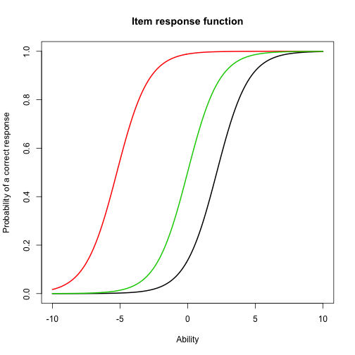 

```r
############
# Item Fit #
############

# First, we want to check the fit of the 1PL (ltm) parameters:
# To make everything uniform, we will change the name of the params! :)
ltm.params <- Try.1PL

# We're going to calculate fit statistics from a for loop!!!
# We will pull out an item, calculate fit on that item, store it ...

# Though, we need to set up the matrix to store the items:
print(n.it <- ncol(person.resp))
```

```
## [1] 75
```

```r
# We will set up a blank matrix:
#   1) The rows will store each item,
#   2) The column will store each of the fit statistics for the items,
#   3) stat (the statistic!), dfr (degrees of freedom), pval (ummm ... p-value?)
item.fit <- matrix(0, nrow = n.it, ncol = 3)

# We want to repeat this for EACH item:
for (i in 1:n.it){
  
  # i is our item index, telling R which item to pull out:
  item <- i
  
  # Now, we can call "item" instead of "i" (to make things easier to read)
  
  # For that item, we want to calculate fit statistics:
  #   1) Plug in the (0, 1) response matrix
  #   2) Plug in the estimated parameters (now, we're trying the 1PL stuff)
  #   3) Tell R which item for which to calculate statistics (i or item)
  #   4) Say what type of fit statistic (we'll do "likelihood ratio")
  #   5) Finally, tell R whether to plot the items and statistics (or not):
  fit.temp <- itf(resp = person.resp, ip = ltm.params$est, item, stat = "lr",
                  do.plot = FALSE, main = paste("Item Fit: Item", item))
  
  # Pull out the "lr" statistic and put it into the 1st column of the ith variable
  # Pull out the "df" and put it into the 2nd column of the ith variable
  # Pull out the "pval" and put it into the 3rd column of the ith variable
  item.fit[i, 1] <- fit.temp[1]
  item.fit[i, 2] <- fit.temp[2]
  item.fit[i, 3] <- fit.temp[3]
}

# So, now we have a matrix of 75 rows (one for each item),
#     and 3 columns (one for each statistic), and maybe a couple warnings :)!

# Next, let's look at the how well "ltm" did with the 1PL:
# First, round to make things easier to see!
ltm.item.fit <- round(item.fit, 3)

# What was the mean Likelihood Ratio Statistic?
mean(ltm.item.fit[ , 1])
```

```
## [1] 27.90233
```

```r
# What was the maximum Likelihood Ratio Statistic?
max(ltm.item.fit[ , 1])
```

```
## [1] 92.014
```

```r
# Which item HAD the maximum Likelihood Ratio Stat (Worse Fitting Item!!!)
which.max(ltm.item.fit[ , 1])
```

```
## [1] 37
```

```r
# Plot That Item!
itemH <- which.max(ltm.item.fit[,1])
itf(person.resp, ltm.params$est, itemH, stat = "lr",
    do.plot = TRUE, main = paste("Item Fit: Item", itemH))
```

 

```
##    Statistic           DF      P-value 
## 9.201369e+01 8.000000e+00 1.813052e-16
```

```r
# Oh how ugly!!!

# Which item HAD the minimum Likelihood Ratio Stat (Worse Fitting Item!!!)
which.min(ltm.item.fit[ , 1])
```

```
## [1] 5
```

```r
# Plot That Item!
itemL <- which.min(ltm.item.fit[,1])
itf(person.resp, ltm.params$est, itemL, stat = "lr",
    do.plot = TRUE, main = paste("Item Fit: Item", itemL))
```

 

```
## Statistic        DF   P-value 
## 0.4947243 8.0000000 0.9998719
```

```r
## Much nicer!


# Plot them side by side
par(mfrow=c(1,2))
itf(person.resp, ltm.params$est, itemH, stat = "lr",
    do.plot = TRUE, main = paste("Item Fit: Item", itemH))
```

```
##    Statistic           DF      P-value 
## 9.201369e+01 8.000000e+00 1.813052e-16
```

```r
itf(person.resp, ltm.params$est, itemL, stat = "lr",
    do.plot = TRUE, main = paste("Item Fit: Item", itemL))
```

 

```
## Statistic        DF   P-value 
## 0.4947243 8.0000000 0.9998719
```

```r
# Remember: High LR -- Line Not Fitting Probabilities
#           Low LR -- Line Pretty Good Est of Probabilities
#           Pretty Sensitive to Slight Deviations from Fit!

# Activity: Chose any item to investigate. Does it fit based on the likelihood ratio test? How does the line fit
# the probabilities?

# Remember the definitions of Information in Estimation:
#   For Everything: expected negative second derivative of log likelihood
#	 For IRT, this becomes: (pprime)^2/(pq)

# The "expected negative second ... " just means the "curvature" of the
# likelihood function!

# Now, we want to work with the function "iif" in irtoys!
# iif takes two (and only two) arguments:
#	1) The item parameters in "matrix" form ... or
#	1) AN item parameter as a "vector"
#	2) A sequence of theta values on which to calculate information ... or
#	2) Nothing, and irtoys will pick the theta values: 99 between [-4, 4]


params.iif <- iif(ltm.params$est)

# Let's see what this object gives us:
names(params.iif)
```

```
## [1] "x" "f"
```

```r
# There are two drawers (sub-objects):
#	1) x: the thetas at which R evaluated information
#	2) f: the actual information values!

# However, staring at information is mindnumbing ... (as usual)
# But, we don't need to stare ... R can actually plot this object!  Neat!               

plot(params.iif)  
## These are all the information functions! 

# For item 1 
plot(y=params.iif$f[,1],x=params.iif$x, type = "l")
```

 

```r
# QUESTION: What does this tell you about the item difficulty (i.e where is it located?)?      
ltm.params$est[1,2]
```

```
##        V1 
## -3.873973
```

```r
# QUESTION: Plot the 50th item. Where is the information at a maximum?

#############################
# Item and Test Information #
#############################

# Remember, Item Info is Summative: TIF = sum(IIF)

# Let's find information for a short test!
# First, let's choose the items that we want to be apart of the test:
test.items <- c(10, 30, 35, 40, 45, 50, 70)

# Above are numbers corresponding to the "item numbers", not the items themselves!

# Now, let's take those items out of the "item.params" object:
test.params <- ltm.params$est[test.items, ]

# So we have a combination function:
#	1) "test.items" is a vector of numbers corresponding to item numbers on the test
#	2) [test.items, ] takes ROWS out of item.params corresponding to item numbers
#		So: pulling out the 10th row, the 30th row, ...
#	3) [test.items, ] keeps ALL of the columns of item.params
#		So: pulling out the 10th row (all columns), the 30th row (all columns), ...
#	4) We're taking the items we want, keeping all the parameters of those items, and
#		sending the whole thing to "test.params"

nrow(test.params)
```

```
## [1] 7
```

```r
# test.params contains all of the items we wanted!  All seven of them!

# Let's pick a few thetas to run:
thet <- c(-3, -2, -1, 0, 1, 2, 3)

# Next, let's run the function "iif" with a matrix to see what happens:
info.20 <- iif(test.params, thet)

# What is contained in the object?
names(info.20)
```

```
## [1] "x" "f"
```

```r
# What does the object look like?
info.20
```

```
## $x
## [1] -3 -2 -1  0  1  2  3
## 
## $f
##              V10        V30        V35        V40        V45        V50
## [1,] 0.135308783 0.11987910 0.11822832 0.08618052 0.06711582 0.04871881
## [2,] 0.078158709 0.17187336 0.17088891 0.14419372 0.12163291 0.09505386
## [3,] 0.038490477 0.17620558 0.17693781 0.18142554 0.17287539 0.15300023
## [4,] 0.017495359 0.12817499 0.12981685 0.16046327 0.17537990 0.18222652
## [5,] 0.007664759 0.07222937 0.07355904 0.10359695 0.12642732 0.15234801
## [6,] 0.003303931 0.03510871 0.03585857 0.05427971 0.07083523 0.09435762
## [7,] 0.001414231 0.01586034 0.01622108 0.02542363 0.03432763 0.04827808
##              V70
## [1,] 0.008738878
## [2,] 0.019867377
## [3,] 0.043319711
## [4,] 0.086328471
## [5,] 0.144349352
## [6,] 0.181453745
## [7,] 0.160332049
## 
## attr(,"class")
## [1] "iif"
```

```r
# So, it's the same thing as before, only "x" has changed (to OUR thet), and
# NOW we have a column corresponding to EVERY item in our test!

# Let's use the "apply" command to sum all of the info:
#	1) apply(object, margin, function)
#	2) So, we stick in our matrix of information: info.20$f
#		(we're summing "f", NOT "x", so we don't have to worry about "x")
#	3) Rows are thetas, columns are items, so we want to sum ACROSS the rows
#	4) Our function is "sum", which is a "vector-function"

tinfo.20a <- apply(info.20$f, 1, sum)

# Try the whole thing using the "tif" command instead of the "iif" command:
# (the "tif" is the SAME as "iif", only it finds "test information")

# So, include the SAME parameters we used AND the thetas at which we evaluated:
tinfo.20b <- tif(test.params, thet)

# Let's see if they're the same:
tinfo.20a
```

```
## [1] 0.5841702 0.8016689 0.9422547 0.8798854 0.6801748 0.4751975 0.3018570
```

```r
tinfo.20b$f
```

```
## [1] 0.5841702 0.8016689 0.9422547 0.8798854 0.6801748 0.4751975 0.3018570
```

```r
# We can also plot test information in EXACTLY the same way as item information,
# only with a "test" of responses rather than an item of responses:
plot(tif(test.params))

# QUESTION: How does the test look?  Is it a good test?  Is it a bad test?

# Compare the "short test" (of 7 items) with the ENTIRE test (of 75 items)
plot(tif(ltm.params$est))
```

 

```r
# QUESTION: Why is the TIF located around the values they are?

####################
# Person Estimates #
####################

# There are 3 estimation methods
# The expected a posteriori estimate 
# Get estimates of person abilities
th.eap <- eap(person.resp,ltm.params$est, qu = normal.qu())

# Examine first few cases
head(th.eap)
```

```
##             est       sem  n
## [1,]  0.2447402 0.3347963 75
## [2,] -0.3835648 0.3229657 75
## [3,] -0.6342567 0.3104584 75
## [4,] -1.7537959 0.3132268 75
## [5,]  0.5334695 0.3331278 75
## [6,]  0.7266595 0.3426313 75
```

```r
# Est corresponds to their estimate person ability
# SEM is the standard error of measurement
# n is the number of non-missing responses

# Getting the estimate using marginal maximum likelihood
th.mle <- mlebme(person.resp,ltm.params$est)
head(th.mle)
```

```
##             est       sem  n
## [1,]  0.2685877 0.3483813 75
## [2,] -0.4253516 0.3351513 75
## [3,] -0.7107962 0.3328255 75
## [4,] -1.9530661 0.3412415 75
## [5,]  0.5881410 0.3586313 75
## [6,]  0.8131421 0.3676998 75
```

```r
# Can also get the maximum a posteriori estimate
th.map <- mlebme(person.resp,ltm.params$est,method = "BM")
head(th.map)
```

```
##             est       sem  n
## [1,]  0.2395468 0.3283222 75
## [2,] -0.3823414 0.3182038 75
## [3,] -0.6398657 0.3161537 75
## [4,] -1.7512373 0.3201072 75
## [5,]  0.5215152 0.3355907 75
## [6,]  0.7172525 0.3417422 75
```

```r
# These estimates are very close, as they should be. 

# 
# Section 7. SEM and CFA
# 

# For CFA and SEM, please refer to 
# http://lavaan.ugent.be/tutorial/index.html
# There is lots of great information there! 
```

